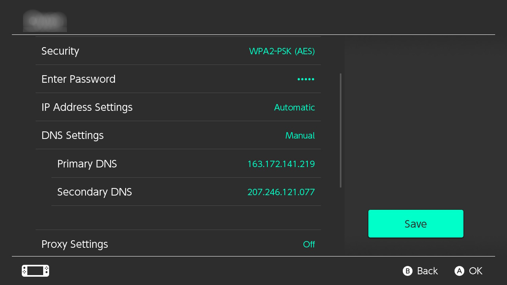
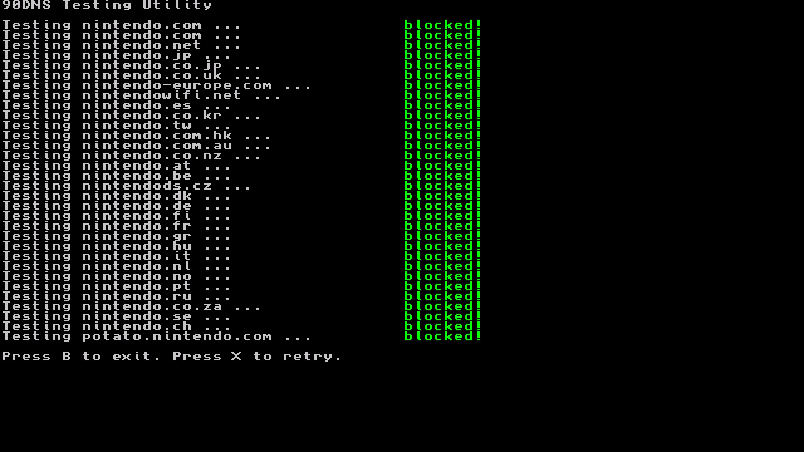

# Blocking Updates

You can add custom DNS to your WiFi connection that will block all communication with the Nintendo servers. This will stop any updates and reporting to Nintendo, but it will prevent use of the eShop and online games.

We will be using [90DNS](https://gitlab.com/a/90dns), a community-run custom DNS server. If you prefer, you can run your own DNS server following the instructions on the [GitLab repository.](https://gitlab.com/a/90dns/blob/master/SELFHOST.md)

&nbsp;

### Instructions

!!! tip ""
    1. Go to the Settings applet, and then to the Internet tab.
    2. Select the WiFi network you are connected to and click `Change Settings`.
    3. Change DNS Settings to Manual.
    4. Pick the Server that is the closest to your device out of the below chart and      enter its Primary and Secondary DNS into your connection.
    5. Save Settings and test connection.
   
| Location                              | Primary DNS         | Secondary DNS       |
|:--------------------------------------|:--------------------|:--------------------|
| Europe (Server located in France)     | `163.172.141.219`   | `207.246.121.77`    |
| America (Server located in the USA)   | `207.246.121.77`    | `163.172.141.219`   |

!!! tip ""
    Example for a 90dns connection with the Europe settings:
    

!!! tip ""
    ### Testing if your 90dns connection is working
    

        
Click to expand!

    !!! tip ""
        1. Download the latest release of the [90dns Tester](https://github.com/meganukebmp/Switch_90DNS_tester/releases)
        2. Place the `Switch_90DNS_tester.nro` in the `switch` folder on your SD
        3. Enter the homebrew menu and run the 90dns Tester
        4. After the test finished it should look similar to the below picture, with every `nintendo` domain being blocked

    !!! tip ""
        

