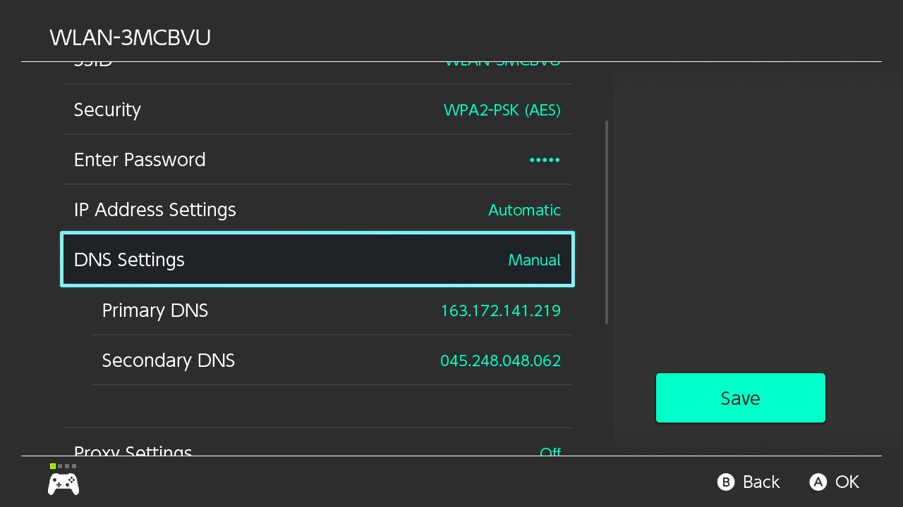

# Blocking Updates

You can add custom DNS to your WiFi connection that will block all communication with the Nintendo servers. This will stop any updates and reporting to Nintendo, but it will prevent use of the eShop and online games.

We will be using [90DNS](https://gitlab.com/ao/90dns), a community-run custom DNS server. If you prefer, you can run your own DNS server following the instructions on the [GitLab repository.](https://gitlab.com/ao/90dns/blob/master/SELFHOST.md)

&nbsp;

### Instructions

!!! tip ""
    1. Go to the Settings applet, and then to the Internet tab.
    2. Select the WiFi network you are connected to and click `Change Settings`.
    3. Change DNS Settings to Manual.
    4. Set Primary DNS to `163.172.141.219`
    5. Set Secondary DNS to `45.248.48.62`
    6. Save Settings and test connection.
   
!!! tip ""
    