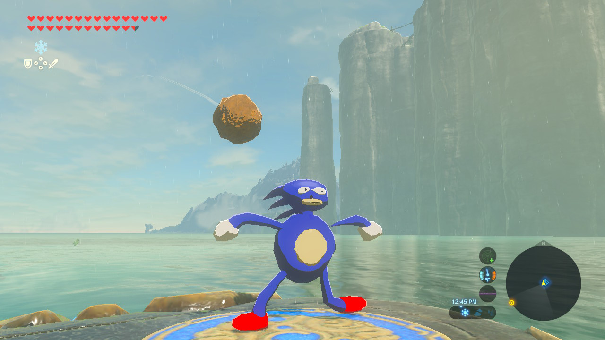

# Game modding with LayeredFS

LayeredFS, a tool built in to Atmosphere, allows you to replace game files with your own.

&nbsp;

### Instructions

!!! tip ""
    Make a folder on your SD card inside the `atmosphere/contents/` folder, with the name being the title ID of the game you would like to replace the files of. **Note: On Atmosphere 0.9.4 and below `contents` is called `titles`**

    Switch game title IDs can be found on [http://nswdb.com/](http://nswdb.com/). If you have a pre-made mod, the files would be placed here. Then, once the title is launched while in Atmosphere, your mod should load.
    
!!! tip "Batman in BOTW"
	
