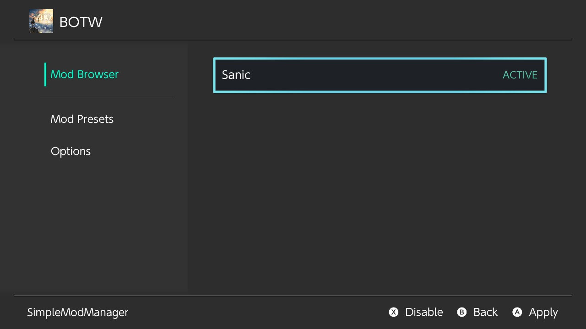

# Game modding with LayeredFS

LayeredFS, a tool built in to Atmosphere, allows you to replace game files with your own. This guide goes over modding *most* games on the Nintendo Switch. certain games like The Elder Scrolls V: Skyrim and Super Smash Bros. are modded differently. A guide for modding Super Smash Bros. Ultimate can be found  <a href="https://gamebanana.com/tuts/12827" target="_blank">here</a>.

&nbsp;

!!!Danger "Ban Warning"
    Make sure to be safe while modding games. Cheating online is a very easy way to get **banned** if you are not careful. Make sure to only use mods that could be considered **cheating** on offline games. If the game has online components, **it may be unsafe to even mod the offline features of the app**. Splatoon, for example, is notorious for banning people who modded the offline campaign and later went online). For these cases it is reccomended to only use unsafe mods for online games in an **offline EmuMMC**. For Smash Ultimate specific mods, consider reading this <a href="https://gamebanana.com/threads/218137" target="_blank">post</a> on GameBanana. For more information regarding bans see the "Is it safe to use homebrew? Will I get banned?" section of the [FAQ](../faq.md)

### What you need

!!! tip ""
    - The latest release of <a href="https://github.com/nadrino/SimpleModManager/releases/" target="_blank">SimpleModManager</a> (Download the `.nro` file)
    - The atmosphere Config file <a href="../../files/extras/override_config.ini" download>override_config.ini</a>
    - The template zip file <a href="../../files/extras/modManager_template.zip" download>template.zip</a>

### SimpleModManager set-up
!!! tip ""
    1. Copy `SimpleModManager.nro` to the `switch` folder on your SD card
    2. Copy `override_config.ini` to `/atmosphere/configs`  (this will set booting mods/cheats to a keybind) 
    **If that file already exists, you can instead append `override_key=L` and `cheat_enable_key=L` onto it**
    3. Extract templates.zip onto the root of your SD card. This will be the template you use for adding mods
    4. Certain simple changes will need to be made to the template to make it work for you: 
    5. Rename the `/mods/gameName` folder to the name of the game
    6. Rename the `/mods/gameName/modName` folder to the name of the mod
    7. Rename the `/mods/gameName/modsName/contents/titleID` folder to the title ID of the game you are modding (see below)
    8. Add any mod folders into `/mods/gameName/modName/contents/titleID`
     if you need to add aditional mods or games, simply follow the template again 
    !!! tp ""
        For this example, the Sanic mod is used which can be found <a href="https://gamebanana.com/mods/246635" target="_blank">here</a>
        
        **Note: The gameName or modName is not sensitive and can technically be anything and is only used by the mod manager for sorting, however the rest of the template has to be exact**
    Switch game title IDs can be found on [http://nswdb.com/](http://nswdb.com/)
### Using SimpleModManger
!!! tip ""
    1. Put your SD card back into your switch and boot into Atmosphere
    2. Launch the homebrew menu by holding R while booting any app or game
    3. Find the app "SimpleModManager" (**if it does not show up, it is because you forgot to copy the SimpleModManager.nro to the switch folder**)
    4. Launch the app and you will now see all your mods which you can apply and disable. Simply apply the mods you want and close the app.
    !!! tip ""
        
    5. To launch a game with mods (or cheats) you will need to hold L while booting the title.
!!! tip "Sanic in BOTW"
	

### Where to find game mods?
!!! tip ""
     <a href="https://gamebanana.com/" target="_blank">GameBanana</a> is generally a good place for mods. here are GameBanana pages for some popular switch games: 
     <a href="https://gamebanana.com/games/featured/6386" target="_blank">Breath of the Wild</a>, 
     <a href="https://gamebanana.com/games/featured/6498" target="_blank">SuperSmash Bros</a>, 
     <a href="https://gamebanana.com/games/featured/6507" target="_blank">Super Mario Kart 8 Deluxe</a>, 
     <a href="https://gamebanana.com/games/featured/6376" target="_blank">Super Mario Odyssey</a>
