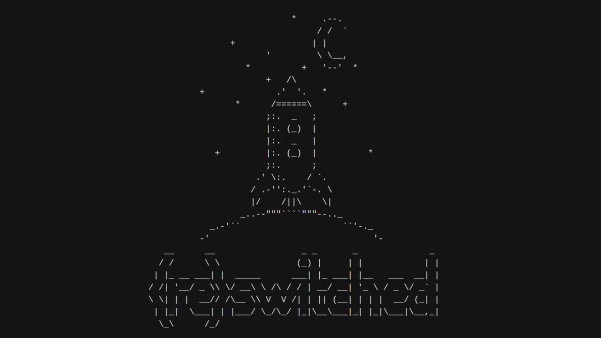

# Testing if your Switch is patched
This section is for manually testing if your Nintendo Switch can use the fusee-gelee exploit.

&nbsp;

### Entering RCM
To enter RCM, please look at [this page.](/switch_guide/user_guide/entering_rcm/) After you've read that and are able to enter RCM, continue on.

&nbsp;

!!! tip ""
    All consoles can enter RCM, regardless of if they are patched or not! This guide will test to see if you can use the fusee-gelee exploit, which is required for the use of CFW. 

!!! tip "Essential files"
    [The fusee test payload](http://misc.ktemkin.com/fusee.bin) by ktempkin

&nbsp;

Follow the directions from the [sending payload guide](/switch_guide/user_guide/sending_payload/), but replace all usage of the hekate.bin payload with the fusee.bin payload you downloaded above.

After you have sent the payload, your console should display an ASCII rocket ship, like pictured below.

!!! tip ""
    

If it does, your console is unpatched, and you can continue on with the guide! If nothing is shown, your console is likely patched. You can double check your serial number with the list [here](/user_guide/getting_started/) if you desire.

&nbsp;

#### [If your console is unpatched, continue to SD Preparation <i class="fa fa-arrow-circle-right fa-lg"></i>](/switch_guide/user_guide/sd_preparation/)
