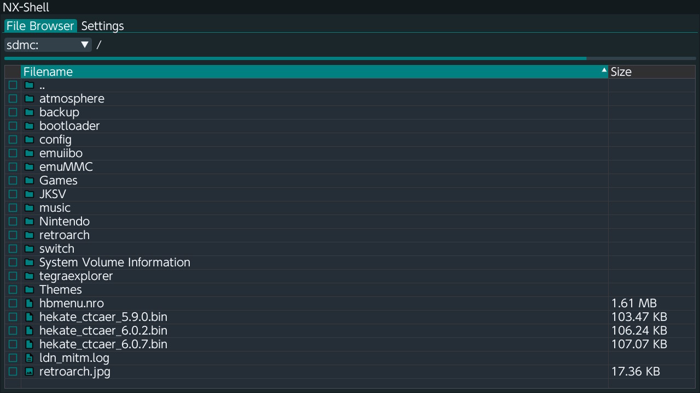

# NX-Shell

NX-Shell is a file manager.

### Common use cases for NX-Shell

- Copying files
- Moving files
- Deleting files
- View properties of files and folders
- Create new folders
- Create new files
- Set the archive bit on files and folders

For more information, you can check out NX-Shell's Github repository [here](https://github.com/joel16/NX-Shell).

### NX-Shell screenshots:

