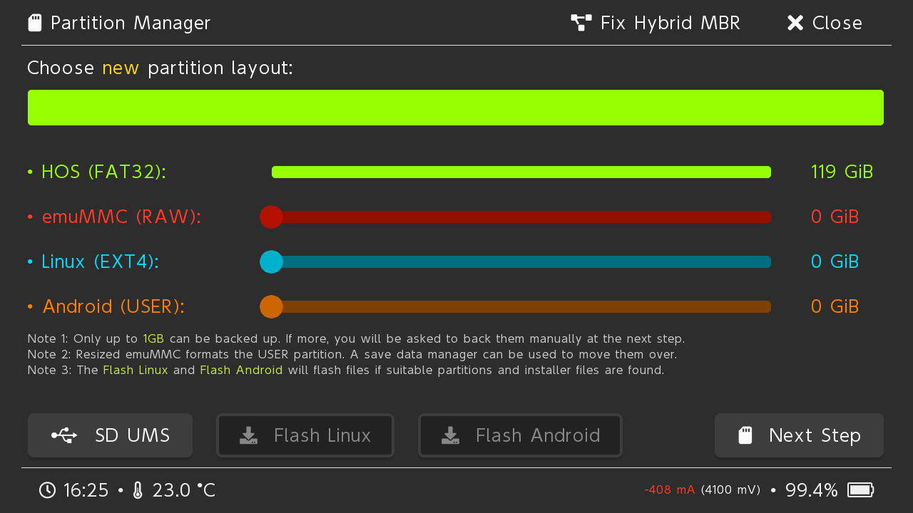

# Formatting and/or partitioning the microSD Card

## What you need:

- Your Switch loaded into hekate

::: danger

**Partitioning *WILL* wipe all data on your microSD card!**

In case you missed the warning earlier, your microSD card will be wiped during this page. Go to `Tools` > `USB Tools` > `SD Card`, plug your switch into your PC via USB and back up the contents of your microSD card to your PC if you haven't done so yet. If you don't mind redownloading all the games stored on the microSD card and/or all other (potentially important) files getting deleted, you may skip this.

:::

## Instructions:

1. Navigate to `Tools` > `Partition SD card`
1. Navigate to `Next Step` at the bottom right, then select `Start` in the menu that appears.
    - If you wish to install Android and/or Linux later, partition your microSD card here accordingly by moving the sliders you see during this step. We recommend setting the `Android (USER)` and `Linux (EXT4)` sliders to at least 16GB.
    - For Android; Select `Legacy` partitioning for Android 10/11 and `Dynamic` partitioning for Android 13+. Legacy and Dynamic partitioning are **NOT** intercompatible.
1. Once done, go to hekate's `Home` menu and then `Tools` > `USB Tools` > `SD Card` and plug your Switch into your PC via USB.
1. Continue with the next step of the guide.
    - Your microSD card should now be accessible on your PC. If not, consult the warning message below.

::: warning

**Your microSD card is not showing up**

If your microSD card isn't showing up at all, ensure that you're using a USB cable capable of data transfer and that if you use Windows, Windows has assigned a drive letter to the FAT32 partition of your microSD card. If you still experience errors, join the [NH-Discord server](https://discord.gg/C29hYvh) for support.

:::

::: tip

[Continue to SD Preparations](sd_preparation)

:::
