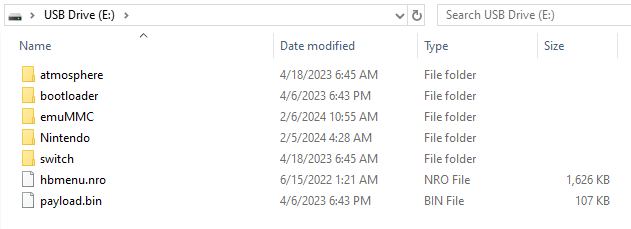

# microSD Card preparations

We will now place the required files for the Atmosphère custom firmware and some additional homebrew files on the microSD card.

Atmosphère has its own bootloader, called fusee. For the purposes of this guide we will be using hekate instead, so that we can back up the system's NAND (internal storage) and take advantage of other advanced features in the future.

::: warning

**File name extensions**

If you use Windows, you should enable file name extensions before continuing. See [this link](../../extras/showing_file_extensions) for a guide on how to do this.

:::

## Section I - Requirements

* The latest release of [hekate](https://github.com/CTCaer/Hekate/releases/) (Download the `hekate_ctcaer_(version).zip` release of hekate)
* The hekate config file: [hekate_ipl.ini](/files/emu/hekate_ipl.ini){download}
* The DNS.MITM DNS redirection config: [emummc.txt](/files/emummc.txt){download}
* The bootlogo zip folder: [bootlogos.zip](/files/bootlogos.zip)
* The latest release of [Atmosphère](https://github.com/Atmosphere-NX/Atmosphere/releases). Download the `atmosphere-(version)-master-(version)+hbl-(version)+hbmenu-(version).zip` release of Atmosphère.
* The latest release of [JKSV](https://github.com/J-D-K/JKSV/releases) (Download the `JKSV.nro` release of JKSV)
* The latest release of [FTPD](https://github.com/mtheall/ftpd/releases) (Download the `ftpd.nro` release of FTPD)
* The latest release of [NXThemesInstaller](https://github.com/exelix11/SwitchThemeInjector/releases) (Download the `NXThemesInstaller.nro` release of NXThemesInstaller)
* The latest release of [NX-Shell](https://github.com/joel16/NX-Shell/releases) (Download the `NX-Shell.nro` release of nx-shell)
* The latest release of [Goldleaf](https://github.com/XorTroll/Goldleaf/releases) (Download the `Goldleaf.nro` release of Goldleaf)

::: danger

**About ChromeOS**

If you're on a Chromebook, the following section may prove to be difficult. The native file manager on ChromeOS does not support basic file manager functionalities such as replacing and/or merging files/folders. Please verify your file and folder placement using the "**Full folder/file structure**" section near the bottom of this page.

:::

## Section II - Instructions

1. Navigate to the accessible drive (`SWITCH SD`).
1. Copy *the contents of* the Atmosphère`.zip` file to the root of your microSD card.
1. Copy the `bootloader` folder from the hekate `.zip` file to the root of your microSD card.
    * Merge and/or replace the content already on your SD card with the files within the `.zip` file if asked to do so. On macOS, you will need to specifically select the `Merge` option if prompted.
1. Copy the `bootloader` folder from the `bootlogos.zip` file to the root of your microSD card.
    * Merge the bootloader folders if asked to do so.
1. Copy `hekate_ipl.ini` to the `bootloader` folder on your microSD card.
    * Replace the file if asked to do so.
1. Create a folder named `hosts` inside the `atmosphere` folder on your microSD card, and put `emummc.txt` inside of the `hosts` folder.
1. Copy `JKSV.nro`, `ftpd.nro`, `NxThemesInstaller.nro`, `NX-Shell.nro` and `Goldleaf.nro` to the `switch` folder on your microSD card.
1. If you were already using your microSD card as a storage device for your games and backed up the Nintendo folder before partitioning your microSD card, please place it back on the root of your microSD card now.
    * *If* you created an emuMMC on the previous page; don't forget to copy the Nintendo folder to `sd:/emuMMC/RAW1/`, in addition to the Nintendo folder on the root of your microSD card.

::: danger

**About emummc.txt**

Putting the `emummc.txt` file provided by this guide into `/atmosphere/hosts` will prevent your emuMMC (emuNAND) from connecting to Nintendo. Not doing this will likely result in a ban.

:::

:::: tip

Your microSD card should look similar to the image below. The `Nintendo` folder will not be present if your Switch has not already booted with the microSD card inserted and the `emuMMC` folder will not be present if you're following the sysCFW path of the guide/you haven't created an emuMMC! The `payload.bin` file will not be present if you're using an unpatched Switch, as it's only for modchipped console users.

If you'd like to check the full folder/file structure of your microSD card, unfold the **Full folder/file structure** section below.

::: details Full folder/file structure (Click to unfold)

Below you will find the full folder/file structure on your microSD card.  
`💾 SWITCH SD:` indicates the root of the microSD card.

```shell
💾 SWITCH SD:
├── 📁 atmosphere
│   ├── 📁 config
│   ├── 📁 config_templates
│   │   ├── 📄 exosphere.ini
│   │   ├── 📄 override_config.ini
│   │   ├── 📄 stratosphere.ini
│   │   └── 📄 system_settings.ini
│   ├── 📁 fatal_errors
│   ├── 📁 flags
│   ├── 📁 hbl_html
│   │   └── 📁 accessible-urls
│   │       └── 📄 accessible-urls.txt
│   ├── 📁 hosts
│   │   └── 📄 emummc.txt
│   ├── 📁 kip_patches
│   ├── 📄 hbl.nsp
│   ├── 📄 package3
│   ├── 📄 reboot_payload.bin
│   └── 📄 stratosphere.romfs
├── 📁 bootloader
│   ├── 📁 ini
│   ├── 📁 payloads
│   ├── 📁 res
│   │   ├── 📄 emu_boot.bmp
│   │   ├── 📄 icon_payload.bmp
│   │   ├── 📄 icon_switch.bmp
│   │   ├── 📄 stock_boot.bmp
│   │   └── 📄 sys_cfw_boot.bmp
│   ├── 📁 sys
│   │   ├── 📁 l4t
│   │   │   ├── 📄 bpmpfw_b01.bin
│   │   │   ├── 📄 bpmpfw.bin
│   │   │   ├── 📄 mtc_tbl_b01.bin
│   │   │   ├── 📄 sc7entry.bin
│   │   │   ├── 📄 sc7exit_b01.bin
│   │   │   └── 📄 sc7exit.bin
│   │   ├── 📄 emummc.kipm
│   │   ├── 📄 libsys_lp0.bso
│   │   ├── 📄 libsys_minerva.bso
│   │   ├── 📄 nyx.bin
│   │   ├── 📄 res.pak
│   │   └── 📄 thk.bin
│   ├── 📄 hekate_ipl.ini
│   ├── 📄 nyx.ini
│   └── 📄 update.bin
├── 📁 emuMMC
│   ├── 📁 RAW1
│   │   ├── 📁 Nintendo
│   │   │   ├── 📁 Album
│   │   │   ├── 📁 Contents
│   │   │   └── 📁 save
│   │   └── 📄 raw_based
│   └── 📄 emummc.ini
├── 📁 Nintendo
│   ├── 📁 Album
│   ├── 📁 Contents
│   └── 📁 save
├── 📁 switch
│   ├── 📄 daybreak.nro
│   ├── 📄 ftpd.nro
│   ├── 📄 Goldleaf.nro
│   ├── 📄 haze.nro
│   ├── 📄 JKSV.nro
│   ├── 📄 NX-Shell.nro
│   ├── 📄 NXThemesInstaller.nro
│   └── 📄 reboot_to_payload.nro
├── 📄 hbmenu.nro
└── 📄 payload.bin
```

:::



::::

::: tip

[Continue to Making Essential Backups](making_essential_backups)

:::
