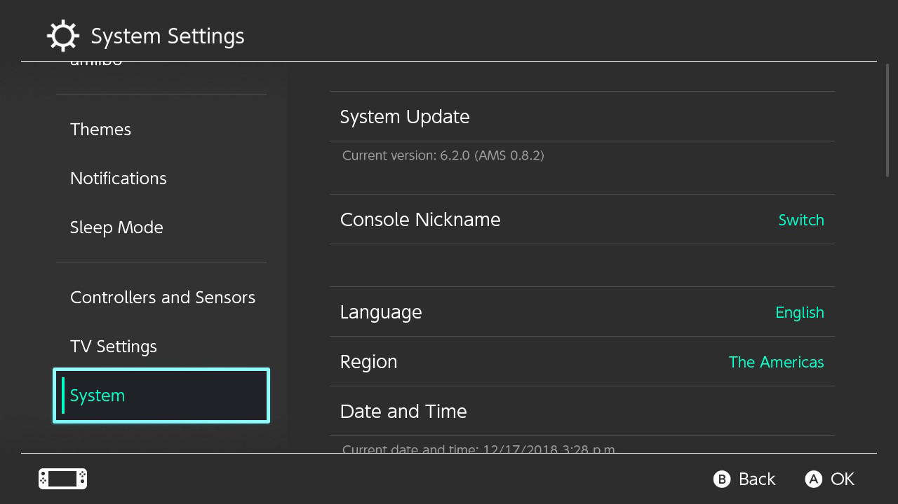

# Launching CFW

Now that the preparation work is out of the way, we're finally ready to launch custom firmware on the Switch.

Unlike systems such as the DSi, Wii, or 3DS, Switch CFW is currently volatile- it will only work as long as your Switch is on. As soon as your Switch completely loses power for any reason (shutting down, battery dying, etc.), CFW will no longer be active and you will need to follow these instructions again.

&nbsp;

!!!danger "Keep emuMMC offline at all times"
    You should keep your emuMMC(emunand) offline (or with 90dns) at all times. Not doing this will likely result in a ban

### Instructions

!!! tip ""
    1. Power on your Switch into RCM, and inject the Hekate payload
    2. Navigate to `Launch` using the touch screen
    3. Find `Atmosphere FSS0 EmuMMC` and launch it

Your Switch is now booting into Atmosphere.

To verify Atmosphere launched properly, open the Settings applet, and navigate to System. You should see `AMS` next to the version number, as well as an `E` at the end, indicating you are booted into emuMMC.

&nbsp;

!!! tip ""
    

&nbsp;

### Launching the Homebrew Menu

You will now be able to launch the Homebrew Menu by holding the R button while launching any game (including demos/cartridges), application (e.g. Youtube/Hulu), or the album. If R is not held, the album, game, or application will launch like normal.
    
!!! warning "A note about using the album for the Homebrew Menu"
    - Using the album for the Homebrew Menu instead of a game or application has several limitations, including but not limited to: a smaller amount of available memory (RAM), as well as being unable to launch a full-featured web browser. It is strongly recommended to launch homebrew through applications or games instead. If your games don't show up as "installed" on your switch, copy the contents of the `Nintendo` folder from the root of the sd card to the `emummc/RAW1/Nintendo` folder
    
!!! tip "Adding new applications"
    - Place homebrew applications (`.nro` files) into the `switch` folder on your SD card.

&nbsp;

### What the included homebrew applications do

!!! tip ""
    - EdiZon is a save manager, it can dump and restore saves from/to your system. For more information, see [Save Management](../../extras/save_management.md)

    - FTPD is a ftp tool for connecting your Switch's sd card wirelessly to your pc. Tools like Filezilla can connect to your switch on `(ip of switch):5000`

    - NX-Shell is a file explorer for the Switch. You can move files, listen to mp3's, view images etc.

    - NXThemeInstaller is a theme installer app. See the [Theming section of our guide](../../extras/theming.md) for more information

    - hbappstore is a homebrew app store where a large collection of switch homebrew is kept.