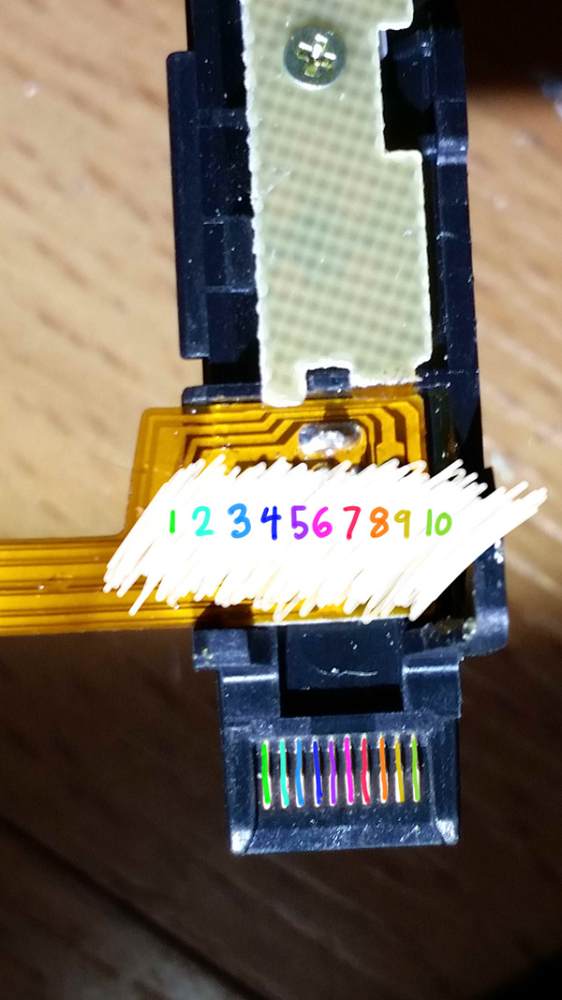
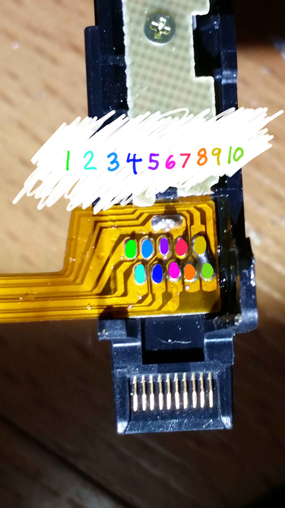
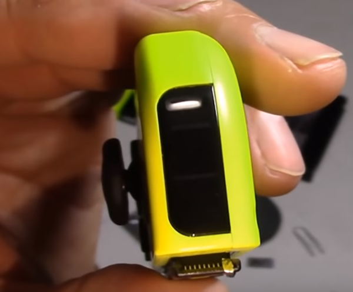
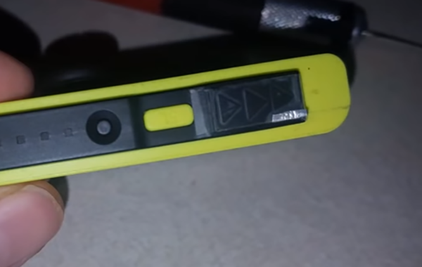
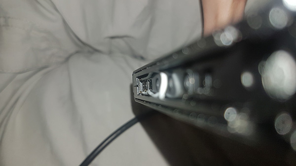
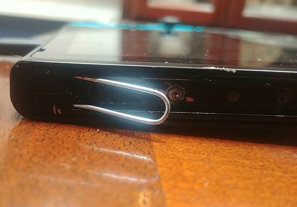
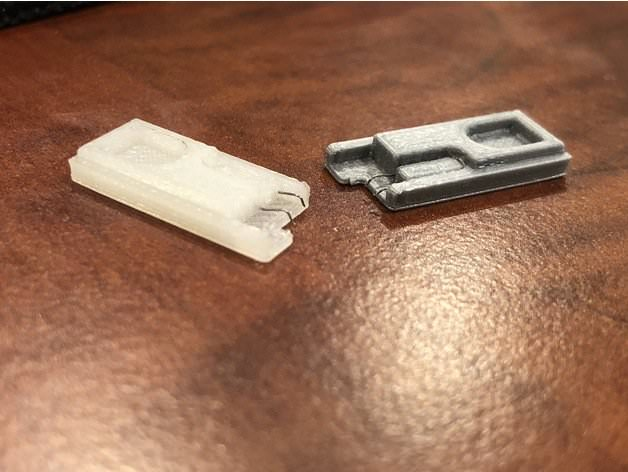
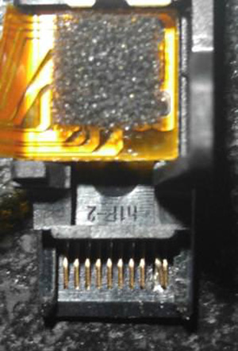
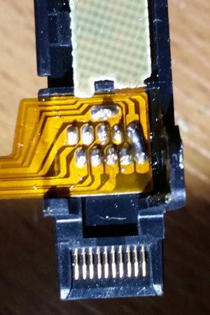
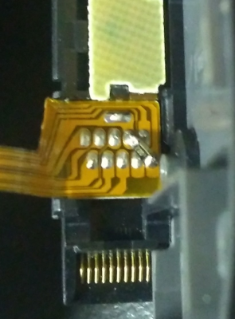

# Entering RCM

As the Switch uses a Tegra X1 processor, it has a special recovery mode that is, in most scenarios, useless for the end-user. Fortunately, due to the fusee-gelee vulnerability, this special mode acts as our gateway into CFW.

There are several methods of entering RCM (**R**e**C**overy **M**ode). The most affordable of these require nothing more than common household items, while the most reliable are very cheap ($10).

Note that patched units **can** enter RCM, but it is useless to us on those systems. Also note that this is a different recovery mode than the one accessed by holding Volume Up, Volume Down, and Power.

RCM is triggered by pressing Volume Up, the home button, and the power button. In this context, the home button doesn't refer to the one on the right Joy-Con, but rather the one on the Switch itself.

While the Switch doesn't have a home button, Nintendo wired it up to pin 10 on the right Joy-Con rail so that they can access RCM for their own purposes. These methods ultimately do the same thing- short pin 10 on the right Joy-Con rail, so that the system believes that the home button is pressed.

The order of methods on this page is in the order of ease. The easiest to immediately accomplish are listed at the top, and the most advanced/difficult methods are at the bottom.

Here is a visual representation of which pins are which.

!!! tip ""
    

Here is a visual representation of which pads are which.

!!! tip ""
    

### Tinfoil

!!! snippet "Note"
    This method will result in the right Joy-Con being detected as in wireless mode while attached to the Switch, and this method may result in the Joy-Con being permanently detected as wireless if you update the Joy-Con firmware while this mod is installed. In the latter case, fixing this requires opening up the Joy-Con and reseating the battery. It is recommended that you only use this to get into RCM, and immediately remove it once you're successfully in RCM.

!!! snippet "Note"
    Take care to not short pin 4 by accident while the system is on. This pin provides power to the Joy-Con, so shorting it by accident may damage your Switch permanently.

This method entails putting a thin piece of tinfoil in between pins 9 and 10 on the Joy-Con, and the Joy-Con rail, then folding the foil over the back of the rail to tape it in place. This is best done by taking a 1 square inch piece of tinfoil, and folding it multiple times.

Here are some examples of the end-result from [8-Bit Flashback on YouTube](https://youtu.be/3-UeB_enPrM?t=136). (Note that video guides tend to get outdated quickly (and the linked one is already outdated), and while we don't recommend any video guides as a result, this one is linked for the purposes of giving a visual on how to successfully do the tinfoil method.)

!!! tip ""
    

!!! tip ""
    

### Metal Bridge / Paperclip

!!! snippet "Note"
    This method is not recommended due to having a serious risk of permanently damaging your Switch's right Joy-Con rail. It is listed here as it is utilizing household items, but it is highly recommended to either do the tinfoil method or to order an RCM jig. This risk is made exponentially higher if a tool such as a screwdriver is used instead of a metal wire or paperclip.

!!! snippet "Note"
    Take care to not short pin 4 by accident while the system is on. This pin provides power to the Joy-Con, so shorting it by accident may damage your Switch permanently.

This method entails taking a piece of metal (such as a paperclip or screwdriver) and bending it so that it touches pins 1 and 10, or any other grounded piece of metal and pin 10.

Here are some examples of shorting pins 1 and 10 using a wire from HowDenKing#0001 on our Discord server.

!!! tip ""
    

!!! tip ""
    

## RCM Jig

!!! snippet "Note"
    Some jig designs use paperclips, inheriting the same risks as the Metal Bridge / Paperclip method. If you would like a safe jig design, we highly recommend [switchjigs.com](https://switchjigs.com).

This method is similar to the Metal Bridge / Paperclip method, but is more reliable and safer in many cases. Jigs hold a wire in place so the correct pins are shorted every time.

Jigs range in price, with the ones we recommend being $10. They're more expensive than other jigs, but spending $10 on a quality jig using 32-gauge wire is a smaller cost than replacing your entire Joy-Con rail after the pins are scratched off by a paperclip jig.

!!! tip ""
    

## Bent Joy-Con Pins

!!! snippet "Note"
    This method will result in the right Joy-Con being detected as in wireless mode while attached to the Switch, and this method may result in the Joy-Con being permanently detected as wireless if you update the Joy-Con firmware while this mod is installed. In the latter case, fixing this requires opening up the Joy-Con and reseating the battery.

!!! snippet "Note"
    This method requires opening your right Joy-Con, voiding its warranty. Not for the faint of heart.

The goal of this method is to open the Joy-Con to the point that you can reach the contact pads easily, and use a thin object such as a knife to gently bend pin 9 onto pin 10, shorting them.

Here is an example from Sonlen#0666 on our Discord server.

!!! tip ""
    

### Soldered Joy-Con Pads - 9 & 10 

!!! snippet "Note"
    This method will result in the right Joy-Con being detected as in wireless mode while attached to the Switch, and this method may result in the Joy-Con being permanently detected as wireless if you update the Joy-Con firmware while this mod is installed. In the latter case, fixing this requires opening up the Joy-Con and reseating the battery. It is recommended to solder pads 7 and 10 together with a resistor instead.

!!! snippet "Note"
    This method requires opening your right Joy-Con, voiding its warranty. Not for the faint of heart.

This is similar to the previous method, however the goal is to solder pads 9 and 10 together.

Here is an example from YyAoMmIi#3705 on our Discord server.

!!! tip ""
    

### Soldered Joy-Con Pads - 7 & 10

!!! snippet "Note"
    This method requires opening your right Joy-Con, voiding its warranty. Not for the faint of heart.

This is similar to the previous method, however the goal is to solder pins 7 and 10 together with a surface-mount 0805 10k resistor. Apart from using a reed switch, this is currently considered the safest method that involves soldering to pads.

Here is an example from stuckpixel#3421 on the ReSwitched Discord server.

!!! tip ""
    

### Booting RCM

While one of these methods are in place, hold Volume Up and the power button. If your switch displays nothing, you are successfully in RCM. If your Switch displays the Nintendo logo and boots normally or immediately shuts down, you didn't successfully enter RCM and should try again.

&nbsp;

#### [Continue to Sending a Payload](sending_payload.md)