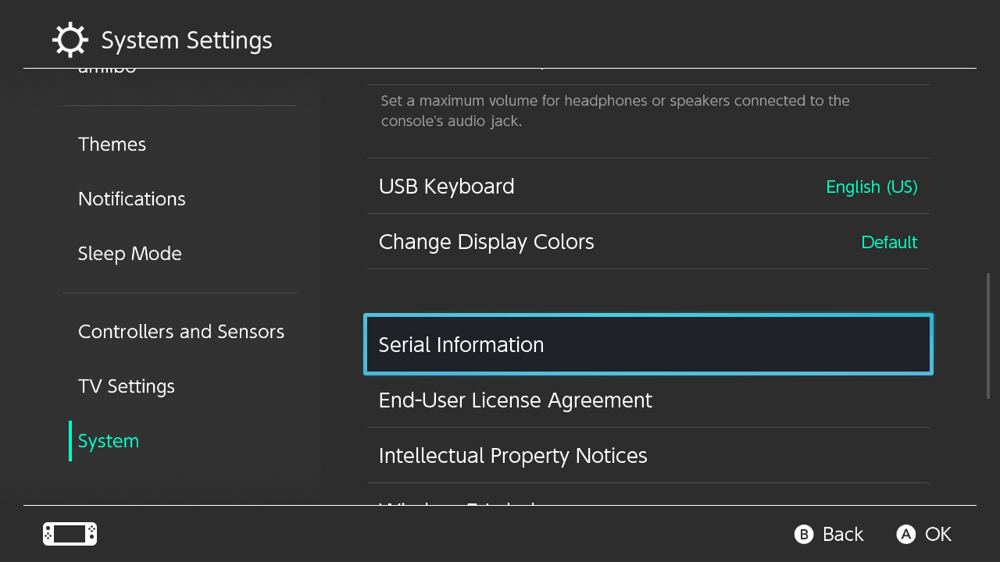

# Getting Started

### Finding your serial number

The first thing to do is determine if your Switch is vulnerable to fusee-gelee, the exploit we will be using to launch CFW.

This vulnerability was independently discovered by several different Switch hacking teams, and multiple variants of it were released to the public in April 2018 after a 90-day disclosure period ended. Nintendo and NVIDIA were made aware of the issue before the public release as a result, and Switch systems that are not vulnerable to the exploit started being spotted in the wild in July 2018. NVIDIA [publicly acknowledged the flaw](https://nvidia.custhelp.com/app/answers/detail/a_id/4660/~/security-notice%3A-nvidia-tegra-rcm-vulnerability) in April as well. In July 2019, Nintendo announced updated consoles, a handheld variant of the Switch called the Switch Lite (HOH-001), and a new model of original Switch (HAC-001-01) with better battery life. Both of these new models use a new processor called the T210b01 (also known as T214 and Mariko) with a new bootROM, and are not hackable at the current time.

Patched and Mariko units can be identified by their serial number. This number can be found on the bottom of your Switch adjacent to the USB-C port, or in the Settings applet at **System -> Serial Information**. 

&nbsp;

!!! tip ""
    

!!! tip ""
        

&nbsp;

### Determining if your Switch is vulnerable

The homebrew community has crowdsourced a list of known serial numbers which are vulnerable to fusee-gelee. 

- If your serial number is on this list as "potentially patched", follow the guide and see if your system works. 
- If your serial number is listed as "patched", there is nothing you can do at this time. 
- If your system is patched, it is highly advised to keep it on 7.0.1 or lower, if possible, as there may be a vulnerability for these versions in the far future. **DO NOT update patched consoles past 7.0.1 if you want to ever have a chance of running homebrew and/or CFW on them.**

!!! tip "Notice"
    If you are unsure if your serial is patched, you can test your console yourself following the instructions [here.](emummc/sending_payload.md)

-----

&nbsp;

### Serial list

The following information is based on [this GBATemp thread](https://gbatemp.net/threads/switch-informations-by-serial-number-read-the-first-post-before-asking-questions.481215/).

|  Serial Numbers  | Unpatched | Potentially patched | Patched |
| :----|:---------------------------------|:---------------------------------|:----------------------|
| XAW1 | XAW10000000000 to XAW10074000000 | XAW10075000000 to XAW10120000000 | XAW10120000000 and up |
| XAW4 | XAW40000000000 to XAW40011000000 | XAW40011000000 to XAW40012000000 | XAW40012000000 and up |
| XAW7 | XAW70000000000 to XAW70017800000 | XAW70017800000 to XAW70030000000 | XAW40012000000 and up |
| XAJ1 | XAJ10000000000 to XAJ10020000000 | XAJ10020000000 to XAJ10030000000 | XAJ10030000000 and up |
| XAJ4 | XAJ40000000000 to XAJ40046000000 | XAJ40046000000 to XAJ40060000000 | XAJ40060000000 and up |
| XAJ7 | XAJ70000000000 to XAJ70040000000 | XAJ70040000000 to XAJ70050000000 | XAJ70050000000 and up |
| XKW1 | **N/A** | **N/A** | XKW10000000000 and up |
| XKJ1 | **N/A** | **N/A** | XKJ10000000000 and up |
| XJW1 | **N/A** | **N/A** | XJW01000000000 and up |
| XWW1 | **N/A** | **N/A** | XWW01000000000 and up |

&nbsp;

### Console Preparation

!!! danger "Important"
    Before setting up the console for homebrew, it is important to have at least one eShop game (such as [Onigiri](https://www.nintendo.com/games/detail/onigiri-switch/)), application (such as [YouTube](https://www.nintendo.com/games/detail/youtube-switch/) or [Hulu](https://www.nintendo.com/games/detail/hulu-switch/)), or a game demo such as [10 Second Run RETURNS](https://www.nintendo.com/games/detail/10-second-run-returns-switch). Running homebrew through any game cartridge will also work, but it must be inserted. Running homebrew does not permanently replace or remove the game/application, nor does it become tied to only one game/application (any cartridge you have inserted or any game/application installed can always be used). Once you have any game or application, you are prepared to continue on with the guide.

&nbsp;

-----

### Version Table

!!! note "Note"
    Nereba and Caffeine how-to guides are currently a Work-In-Progress (WIP)!
    
!!! note "Note"
    While the "New" Switch (HAC-001-01)'s earliest possible firmware is 7.0.1, it is **not** vulnerable to *déjà vu*, the exploit used by Nereba and Caffeine, because of hardware differences from the "Old" Switch (HAC-001).

&nbsp;

| Firmware Version | Unpatched Switches (HAC-001) | Patched Switches (HAC-001) | "New" Switch (HAC-001-01)   | Switch Lite (HDH-001)  | 
|:--------------|:--------------------------------|:---------------------------|:----------------------------|:-----------------------|
| 1.0.0         | Nereba or [**RCM**](rcm.md)     | **N/A**                    | **N/A**                     | **N/A**                |
| 2.0.0 - 3.0.2 | Caffeine or [**RCM**](rcm.md)   | **N/A**                    | **N/A**                     | **N/A**                |
| 4.0.0 - 4.1.0 | Caffeine or [**RCM**](rcm.md)   | Caffeine                   | **N/A**                     | **N/A**                |
| 5.0.0 - 7.0.0 | [**RCM**](rcm.md)               | Wait for CFW               | **N/A**                     | **N/A**                |
| 7.0.1         | [**RCM**](rcm.md)               | Wait for CFW               | Cart update to 8.0.1        | **N/A**                |
| 8.0.1         | [**RCM**](rcm.md)               | Wait for homebrew          | Wait for homebrew           | Wait for homebrew      |
| 8.1.0 - 9.0.1 | [**RCM**](rcm.md)               | Unhackable (currently)     | Unhackable (currently)      | Unhackable (currently) |

&nbsp;

#### [If your Switch is not patched, continue to RCM <i class="fa fa-arrow-circle-right fa-lg"></i>](rcm.md)
