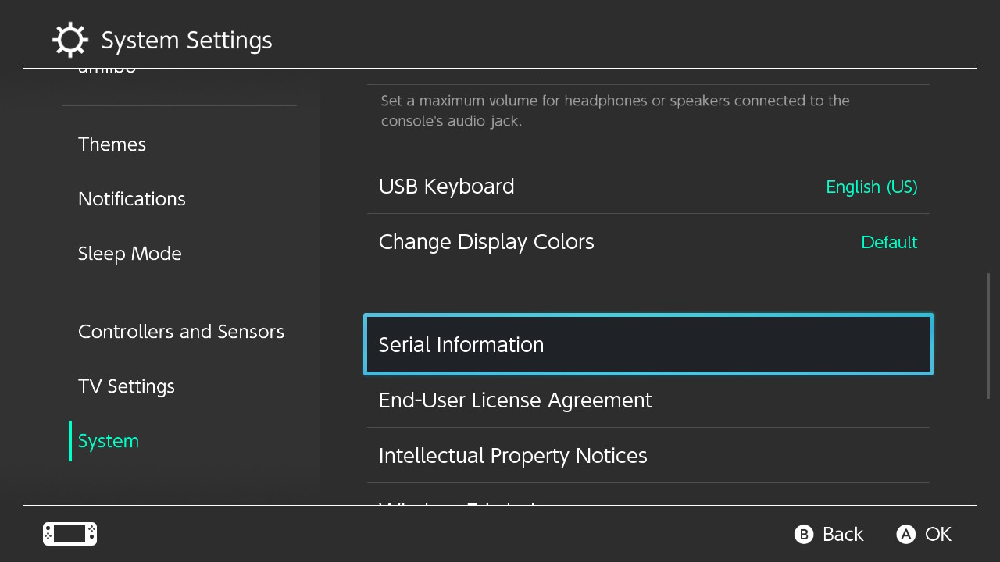
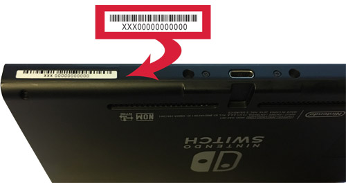

# Getting Started

::: tip

**About modchipped Switch console users**

If you already know you have a modchipped Switch console, you can skip ahead to the [Modchip Introduction](../user_guide/modchip/index) page.

A modchip is a physical modification to the motherboard of your Switch. It cannot be installed without decent microsoldering experience. You can outsource this work to people who are willing to do the job for you, or you can also view the following guide if you are willing- and able to install one yourself.

::: tip

<a href="https://guide.nx-modchip.info/" class="btn btn-solid">Modchip Installation guide →</a>

**Note:** The above guide is not hosted or supported by NH Server; we cannot provide support for reviving consoles ruined by inexperience.

:::

## Finding your serial number

In the RCM path, we'll first determine if your Switch is vulnerable to fusee-gelee, the exploit we will be using to launch CFW.

The fusee-gelee vulnerability was discovered independently by different Switch hacking teams, who all independently released versions of the exploit in April 2018. Nintendo and NVIDIA were informed 90 days before these releases, and patched consoles were launched by mid-2018. NVIDIA [publicly acknowledged the flaw](https://nvidia.custhelp.com/app/answers/detail/a_id/4660/~/security-notice%3A-nvidia-tegra-rcm-vulnerability) in April as well. In July 2019, Nintendo announced updated consoles: the Switch Lite (HDH-001), and a new model of original Switch (HAC-001(-01)/"V2") with better battery life. Both of these new models use the Tegra X1+ (also known as Mariko, the T214, and T210B01) with a brand-new bootROM, and cannot currently be hacked without a modchip.

Patched and Mariko units can be identified by their serial number. This number can be found in the Settings applet at **System -> Serial Information**. You can also find it on the bottom of the console, adjacent to the charging port. However, it is always more accurate to use the serial reported in Settings instead, especially if you aren't the original owner of the console.

## Determining if your Switch is vulnerable

The community has crowdsourced a list of known serial numbers which are vulnerable to fusee-gelee.

::: info

Enter your Switch serial number to check if it's exploitable via RCM:
<!-- @include: @/_internal/serialNumberChecker.html -->

:::

If you would rather look at a table containing serial number ranges, unfold the `Serial list` section below.
::: details Serial list

The following information is based on [this GBATemp thread](https://gbatemp.net/threads/switch-informations-by-serial-number-read-the-first-post-before-asking-questions.481215/).

| Serial Numbers | Unpatched | Potentially patched | Patched |
| :------------- | :----------------------------------------- | :---------------------------------------------------- | :------------------------------------- |
| XAW1           | XAW10000000000 to XAW10065000000           | XAW10065000000 to XAW10120000000                      | XAW10120000000 and up                  |
| XAW4           | XAW40000000000 to XAW40011000000           | XAW40011000000 to XAW40012000000                      | XAW40012000000 and up                  |
| XAW7           | XAW70000000000 to XAW70017500000           | XAW70017500000 to XAW70030000000                      | XAW70030000000 and up                  |
| XAW9           | **N/A**                                    | XAW90000000000 and up                                 | **N/A**                                |
| XAJ1           | XAJ10000000000 to XAJ10020000000           | XAJ10020000000 to XAJ10030000000                      | XAJ10030000000 and up                  |
| XAJ4           | XAJ40000000000 to XAJ40044000000           | XAJ40044000000 to XAJ40083000000                      | XAJ40083000000 and up                  |
| XAJ7           | XAJ70000000000 to XAJ70040000000           | XAJ70040000000 to XAJ70050000000                      | XAJ70050000000 and up                  |
| XAJ9           | **N/A**                                    | XAJ95000000000 and up                                 | **N/A**                                |
| XAK1           | **N/A**                                    | XAK10000000000 and up                                 | **N/A**                                |
| XAK4           | **N/A**                                    | XAK40000000000 and up                                 | **N/A**                                |
| XAK7           | **N/A**                                    | XAK70000000000 and up                                 | **N/A**                                |
| XAK9           | **N/A**                                    | XAK90000000000 and up                                 | **N/A**                                |

If your serial number is not listed above, your device is not vulnerable to the fusee-gelee exploit.

:::

## Firmware Version Table

The table below shows firmware version information regarding the available exploits based on the firmware version your Switch is on. Any firmware version past `4.1.0` is not vulnerable to software exploits.

* **RCM** means your Switch is vulnerable to the fusee-gelee exploit in RCM.
* **Caffeine** is an old software exploit that works with firmware version `4.1.0`.
* **Modchip** means you need to have a modchipped Switch.

| System Version | Unpatched Switch Systems | Patched or Mariko Switch Systems |
| :------------- | :----------------------- | :------------------------------- |
| 1.0.0 - 4.0.1  | [**RCM**](rcm/index)     | **N/A**                          |
| 4.1.0          | [**RCM**](rcm/index)     | Caffeine                         |
| 5.0.0+         | [**RCM**](rcm/index)     | [**Modchip**](modchip/index)     |

## Continue with the right path for your Switch

::::: cards

:::: card

**If your Switch is not patched, click the button below to follow the RCM path of the guide.**

<a href="rcm/index" class="btn btn-solid">Continue to RCM →</a>

::::

:::: card

**If your Switch is patched and modchipped, click the button below to follow the Modchip path of the guide.**

<a href="modchip/index" class="btn btn-solid">Continue to Modchip introduction →</a>

::::

:::::

::: details Frequently Asked Questions about this page

* **Q: How reliable is the crowdsourced list of vulnerable serial numbers, and what if my serial number is not listed?**

    A: To our knowledge, there hasn't been a single console which has disproved the trends documented here. Unless your serial is potentially patched, you can be certain that the table is accurate to reality.
    
:::
