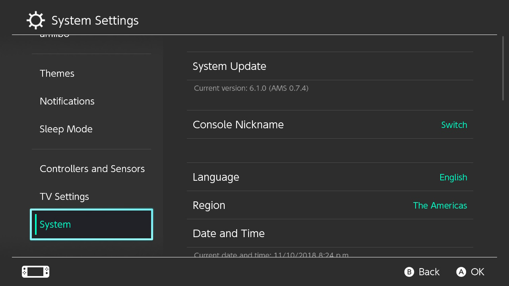

# Launching CFW

Now that the preparation work is out of the way, we're finally ready to launch custom firmware on the Switch.

Unlike systems such as the DSi, Wii, or 3DS, Switch CFW is currently volatile- it will only work as long as your Switch is on. As soon as your Switch crashes, is shut down, or restarted, CFW will no longer function and you will need to follow these instructions again.

## Instructions

!!! tip ""
    1. Power on your Switch into RCM, and upload the Hekate payload
    2. Navigate to `Launch firmware` with the volume buttons, and press the power button to confirm
    3. Navigate to `Atmosphere` with the volume buttons, and press the power button to confirm

Your switch is now booting into Atmosphere.

To verify Atmosphere launched properly, open the Settings applet, and navigate to System. You should see `AMS` next to the version number.

&nbsp;

!!! tip ""
    

&nbsp;

You will now be able to launch the Homebrew Menu by launching the Album applet. To launch into the actual gallery, launch the Album applet while holding the (R) button.

Place homebrew applications into the `switch` folder on your SD card.

&nbsp;

### Basic use cases for included homebrew

!!! tip ""
    - Checkpoint is a save manager, it can dump and restore saves from/to your system. Dumped saves are stored in `switch/checkpoint/saves`

    - FTPD is a ftp tool for connecting your switch's sd card wirelessly to your pc. Tools like Filezilla can connect to your switch on `(ip of switch):5000`

    - NX-Shell is a file explorer for the switch. You can move files, listen to mp3's, view images etc.