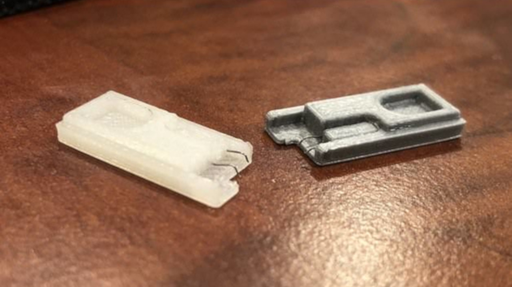
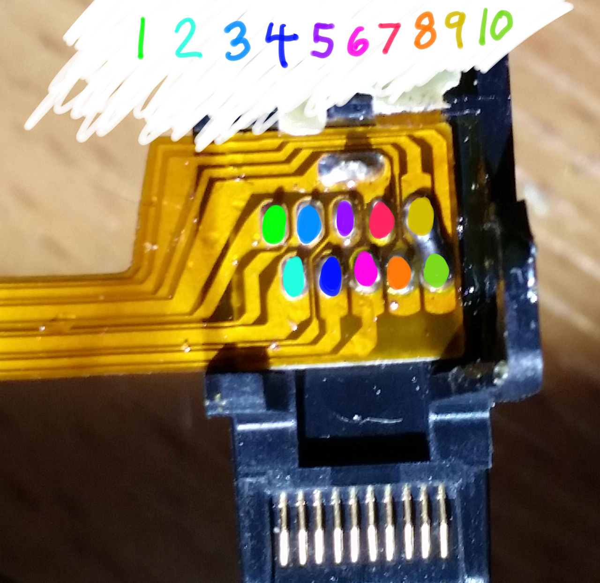
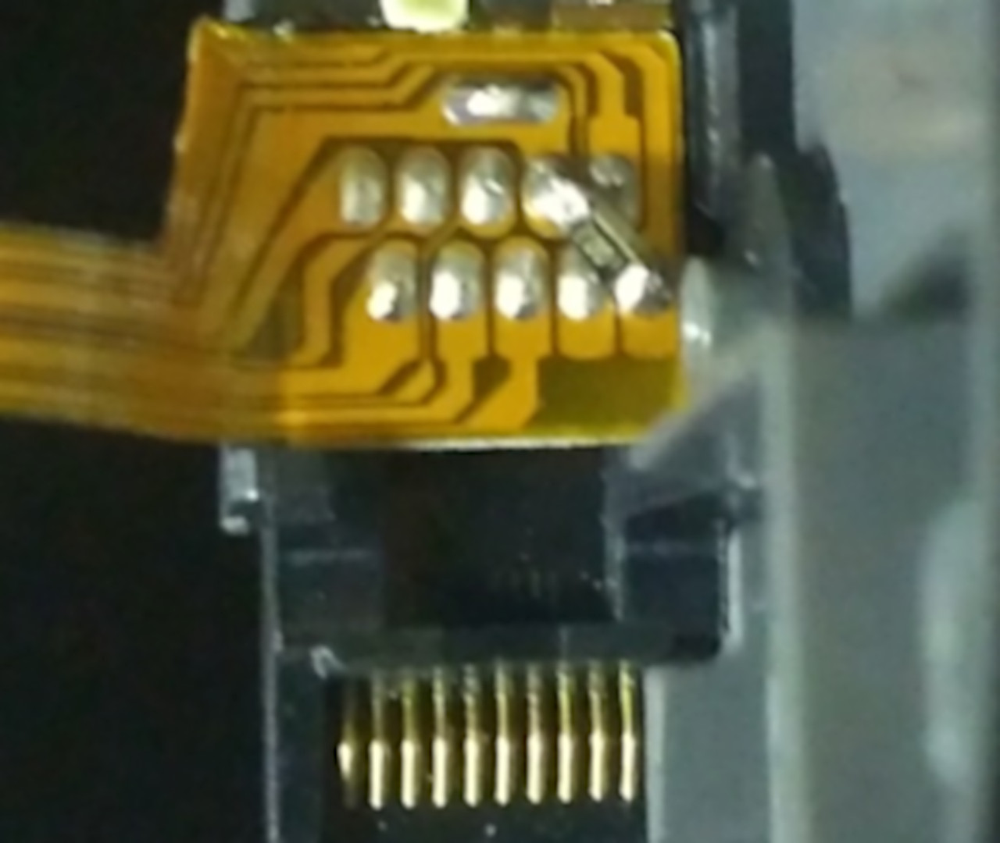

# Entering RCM

The Switch's Tegra X1 processor has a recovery mode referred to shorthand as RCM, intended to be useless for end-users. Fortunately, due to the fusee-gelee vulnerability, this special mode acts as our gateway into CFW.

Methods to enter RCM can require nothing more than household items (not recommended) to affordable tools ($5-10) available on platforms like AliExpress and Amazon. Avoid the "metal bridge" or "paperclip method" as it can damage your console. You can also consider 3D printing necessary tools.

::: danger

**Patched Switch**

Note that patched units **can** enter RCM, but it is not possible to send a payload on those systems. Also note that RCM is a different recovery mode than the one accessed by holding Volume Up, Volume Down and powering on your console.

:::

::: tip

**Information about the methods below**

The order of methods on this page is in the order of ease. The easiest method to immediately accomplish is the `RCM Jig` method. The most advanced/difficult methods are mentioned in the other tabs and should not be attempted by most people as they require voiding your warranty and/or soldering.

**USING A PAPERCLIP OR TIN FOIL CAN/WILL DAMAGE YOUR CONSOLE, DO NOT DO THIS!**

:::

## Instructions:

1. Power off the Switch and short the pins on the right Joy-Con rail using one of the methods listed below.
1. While holding the `Volume Up` button, press the `Power` button once while holding `Volume Up`.
    - If your Switch displays the Nintendo logo and boots normally (or the screen was on and goes black), you didn't successfully enter RCM and should try again. Otherwise, if your console still has a black screen (even after tapping the power button again), your Switch is in RCM and you can let go of the `Volume Up` button.
1. Once your Switch is in RCM, remove the RCM jig (if applicable) and continue with the next page of the guide by clicking on the button at the bottom of this page.

::::: tabs

:::: tab default RCM Jig

Some jig designs use paperclips, inheriting the same risks as the "metal bridge" / "paperclip method" and should not be done.

Once you have successfully entered RCM, you can take the jig out of the Joy-Con rail.

This method is similar to the "metal bridge" / "paperclip method", but is more reliable and safer in many cases. Jigs hold a wire in place so the correct pins (10 and a ground) are reliably shorted.

#### The RCM jig pictured below is the model we recommend:

{ width="250"}

-----

::: details Making your own RCM Jig

If you plan on making your own jig, the second image lays out the right Joy-Con pad out on the console. Make sure your jig NEVER touches pin 4. Pin 4 provides 5 volts of power to the Joy-Con, and can permanently damage the rail or console if shorted.
{ width="600"}

{ width="600"}

:::

::::

:::: tab Soldered Joy-Con Pads - Physical RCM Button

This method requires opening your right Joy-Con, voiding its warranty. Not for the faint of heart.

This method comes to us from the mind of `pbanj` on Discord. All pictures of this method in action were provided by him, with some supplementary images provided by `eip618` on Discord.

The goal of this method is to open the right Joy-Con to the point that you can reach the contact pads easily. This is similar to the previous method, however you will be soldering wires to pins 7 and 10 (shown below) and wiring them to the "rail release button" at the top back of the right Joy-Con.

#### JoyCon pad pinout:
{ width="600"}

In order to start this method you will want to take two lengths of wire, and wrap one end of each into a small circle.

#### Wire reference:
{ width="675"}

You will then want to take the circular end of one of the wires and add a small amount of solder, keeping it mostly flat (ONLY DO THIS TO ONE OF THE WIRES!). You will then glue this wire down to the below point on the rail release button. Make sure glue doesn't cover the top of the solder/wire as it will act as a contact point. Also, ensure that you leave enough space for the button to function correctly. Try pushing the button from the outside and observing its travel path so that you can see where and how you should safely glue the solder glob.

#### Joy-Con button:
{ width="650"}

#### Joy-Con button:
{ width="650"}

The first wire should now be in place as seen by the green circle below. The second wire does not need any solder, instead you will hold it in place using the screw as shown by the red circle in the picture below.

#### Joy-Con button in place:
{ width="650"}

Pressing the Joy-Con button in you should now notice the solder point you created making contact with the piece of metal held in by the screw. Once you have these elements in place you want to connect one wire to pad 7 and the other to pad 10 (it doesn't matter which is which). After that you have successfully created an RCM button on your Joycon. You will now need to hold down the Joycon release button when attempting to boot RCM.

#### Successful installation:
{ width="650"}

::::

:::: tab Soldered Joy-Con Pads - 7 & 10

This method requires opening your right Joy-Con, voiding its warranty. Not for the faint of heart.

The goal of this method is to open the right handed Joy-Con to the point that you can reach the contact pads easily. This is similar to the previous method, however the goal is to solder pins 7 and 10 (shown below) together with a surface-mount `0805 10k` resistor. Apart from using a physical switch/button, this is currently considered the safest method that involves soldering to pads.

#### JoyCon pad pinout:
{ width="600"}

Here is an example from `stuck_pixel` from the ReSwitched Discord server.

#### Successful installation:
{ width="650"}

::::

:::: tab Soldered Joy-Con Pads - 9 & 10

This method will result in the right Joy-Con being seen as "detached" while physically connected to the Switch, so it will not be able to charge. This method may result in the Joy-Con being permanently detected as wireless if you update the Joy-Con firmware while this mod is installed. In the latter case, fixing this requires opening up the Joy-Con and reseating the battery. It is recommended to solder pads 7 and 10 together with a resistor instead.

This method requires opening your right Joy-Con, voiding its warranty. Not for the faint of heart.

The goal of this method is to open the right Joy-Con to the point that you can reach the contact pads easily. This is similar to the previous method, however the goal is to solder pads 9 and 10 (seen below) together. This can either be done using a small wire, or directly bridging the pads with solder.

#### JoyCon pad pinout:
{ width="600"}

Below is an example from `yami0666` from our Discord server.

#### Successful soldering job:
{ width="650" }

::::

:::: tab Bent Joy-Con Pins (Not recommended)

This method will result in the right Joy-Con being detected as in wireless mode while attached to the Switch, and this method may result in the Joy-Con being permanently detected as wireless if you update the Joy-Con firmware while this mod is installed. In the latter case, fixing this requires opening up the Joy-Con and reseating the battery.

This method requires opening your right Joy-Con, voiding its warranty. Not for the faint of heart.

The goal of this method is to open the right handed Joy-Con to the point that you can reach the contact pads easily, and use a thin object such as a knife to gently bend pin 9 and 10 (shown below) slightly up and towards each other so they touch, shorting them.

#### JoyCon pinout:
{ width="600"}

Here is an example from `sonlen` on our Discord server.

#### Bent Joy-Con pins:
{ width="650"}

::::

:::::

::: tip

[Continue to Sending a Payload](sending_payload)

:::
