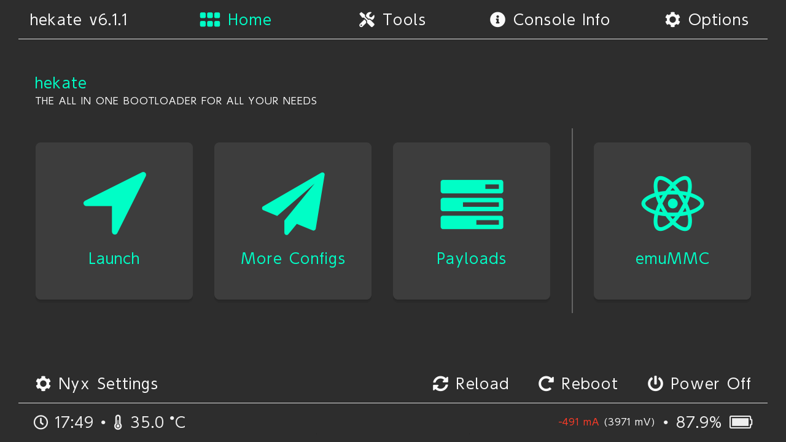

# Sending a Payload

::: warning

**If you are here to test if your Switch is patched**

Make sure you have [put your device into RCM](entering_rcm) and downloaded hekate. Once finished, if your console is **not** patched, continue with the "Preparing hekate" section at the bottom of the page.

:::

Now that the device is in RCM, we will need to send it a payload. The methods are mostly the same but slightly differ depending on what hardware you have available.

## Injecting a payload

::::: tabs

:::: tab default Windows

### What you need:

- The latest release of [TegraRcmGUI](https://github.com/eliboa/TegraRcmGUI/releases) (either the MSI or zip)
- A USB-A to USB-C cable (or a standard USB-C cable if your computer natively supports USB-C)
- The latest release of [hekate](https://github.com/CTCaer/Hekate/releases/). The hekate payload (`hekate_ctcaer_(version).bin`) is located inside of the `hekate_ctcaer_(version).zip`.

### Instructions:

1. Install and run TegraRcmGUI.
1. Navigate to the `Settings` tab, then press `Install Driver` and follow the on-screen instructions.
    - If you face issues when installing the driver, follow the [driver installation with Zadig](#driver-installation-with-zadig) section below.
1. Connect your Switch in RCM to your PC using the USB cable.
1. Navigate to the `Payload` tab of TegraRcmGUI.
    - Your Switch should be shown as detected in the bottom left corner.
1. Press the file button next to `Inject payload`, and navigate to and select the `hekate_ctcaer_X.X.X.bin` file.
    - Do not use the hekate payload included in TegraRcmGUI. It is outdated and missing a feature needed later in the guide.
1. Click `Inject payload` to launch the payload you selected.
    - If your payload was successfully injected your switch should have yellow text that says "Update bootloader folder!", this will be resolved soon.

### Driver installation with Zadig

Follow these steps if you face issues when installing the driver with TegraRcmGUI. You will need the latest version of [Zadig](https://zadig.akeo.ie).

1. Launch Zadig. In the `Options` menu, be sure that `List All Devices` is enabled.
1. Connect your Switch in RCM to your PC using the USB cable.
1. In Zadig, select "APX" in the device list.
1. Select `libusbK (v3.1.0.0)` in the driver list.
1. Click `Install Driver` and wait for the installation to finish.

If you experience issues with TegraRcmGUI or you just want to try a different payload injector, you can check out JTegraNX by unfolding the section below. 

::: details Alternative payload injector for Windows {closed}

### What you need:

- The latest release of [JTegraNX](https://github.com/DefenderOfHyrule/JTegraNX/releases)
- A USB-A to USB-C cable (or a standard USB-C cable if your computer natively supports USB-C)
- The latest release of [hekate](https://github.com/CTCaer/hekate/releases/). The hekate payload (`hekate_ctcaer_(version).bin`) is located inside of the `hekate_ctcaer_(version).zip`.
- At least Java 11+ (ideally 21 LTS)

### Instructions:

1. Download and run the JTegraNX-X.X.X.jar file.
1. Connect your Switch in RCM to your PC using the USB cable.
1. Click the `Browse for payload` button, then navigate to- and select the `hekate_ctcaer_X.X.X.bin` file.
    - **Note:** You can also click the `Payloads` tab at the top of the JTegraNX window and select the latest hekate payload from there.
1. Click the `Inject payload` button.
    - If your payload was successfully injected your switch should have yellow text that says "Update bootloader folder!", this will be resolved soon.

:::

::::

:::: tab Linux

### What you need:

- The latest release of [JTegraNX](https://github.com/DefenderOfHyrule/JTegraNX/releases)
- A USB-A to USB-C cable (or a standard USB-C cable if your computer natively supports USB-C)
- The latest release of [hekate](https://github.com/CTCaer/hekate/releases/). The hekate payload (`hekate_ctcaer_(version).bin`) is located inside of the `hekate_ctcaer_(version).zip`.
- At least Java 11+ (ideally 21 LTS)

### Instructions:

1. Download and run the JTegraNX-X.X.X.jar file. (This can be done from terminal or from your file manager.) 
    - **Note:** You will need to run JTegraNX as root, unless you follow the instructions at [Linux injection without root](../../extras/adding_udev).
1. Connect your Switch in RCM to your PC using the USB cable.
1. Click the `Browse for payload` button, then navigate to- and select the `hekate_ctcaer_X.X.X.bin` file.
    - **Note:** You can also click the `Payloads` tab at the top of the JTegraNX window and select the latest hekate payload from there.
1. Click the `Inject payload` button.
    - If your payload was successfully injected your switch should have yellow text that says "Update bootloader folder!", this will be resolved soon.

---

If you experience issues with JTegraNX, you just want to try a different payload injector or you don't want to use Java, you can check out fusee-nano by unfolding the section below. 
    
- **Note:** fusee-nano has a tendency to simply not work on *some* system configurations for unknown reasons. Please keep this in mind.

::: details Alternative payload injector for Linux {closed}

### What you need:

- The latest release of [fusee-nano](https://github.com/DefenderOfHyrule/fusee-nano/releases) (also available on the [AUR](https://aur.archlinux.org/packages/fusee-nano))
    - If you use Arch Linux or a derivative distro, the AUR package is recommended.
- A USB-A to USB-C cable (or a standard USB-C cable if your computer natively supports USB-C)
- The latest release of [hekate](https://github.com/CTCaer/hekate/releases/). The hekate payload (`hekate_ctcaer_(version).bin`) is located inside of the `hekate_ctcaer_(version).zip`.

### Instructions:

1. Download and run the payload injector from your terminal. You will need to run the injector as root, unless you follow the instructions at [Linux injection without root](../../extras/adding_udev).
1. Connect your Switch in RCM to your PC using the USB cable.
1. Run fusee-nano with: `./fusee-nano /path/to/hekate-ctcaer_X.X.X.bin`
    - As mentioned earlier, unless you have followed the instructions at [Linux injection without root](../../extras/adding_udev), this will require root to run. For most systems, this is done with `sudo`
    - If your payload was successfully injected your switch should have yellow text that says "Update bootloader folder!", this will be resolved soon.

::::

:::: tab Mac

### What you need:

- The latest release of [CrystalRCM](https://github.com/prayerie/CrystalRCM/releases) (the `CrystalRCM.(version).dmg` file)
- A USB-A to USB-C cable (or a standard USB-C cable if your computer natively supports USB-C)
- The latest release of [hekate](https://github.com/CTCaer/hekate/releases/). The hekate payload (`hekate_ctcaer_(version).bin`) is located inside of the `hekate_ctcaer_(version).zip`.

### Instructions:

1. Download the latest release of CrystalRCM.
1. Mount the `CrystalRCM.(version).dmg` file, open the mounted disk image in File Explorer and copy the `CrystalRCM.app` file inside of the mounted disk image to any location on your Mac.
1. Open the `CrystalRCM.app` app, then click `Payload...` and select the `hekate_ctcaer_X.X.X.bin` file.
    - macOS may warn you about the application being downloaded from the internet. To get around this warning, hold the control key while clicking the application, then click Open and Open again.
    - **macOS Sequoia users:** Apple has changed how unsigned applications from the internet are opened. You will need to follow the instructions [here](https://wiki.hacks.guide/wiki/Open_unsigned_applications_on_macOS_Sequoia) to open the application.
1. Connect your Switch in RCM to your PC using the USB cable, make sure it's also detected in CrystalRCM.
1. Once selected, click `Push!`. The payload should now be injected successfully.
    - If your payload was successfully injected your switch should have yellow text that says "Update bootloader folder!", this will be resolved soon.

::::

:::: tab Mac-Alternative

This is an alternative incase CrystalRCM does not work for you.

### What you need:

- The latest release of [JTegraNX](https://github.com/DefenderOfHyrule/JTegraNX/releases)
- A USB-C to USB-A cable **or** a USB-C to USB-C cable capable of transfering data
- The latest release of [hekate](https://github.com/CTCaer/hekate/releases/) (Note: the hekate boot file is inside the .zip as a .bin file)
- Basic terminal knowledge (for instance, cd)
- Atleast Java 11 or more (ideally 21 LTS)

### Instructions

1. Download the JTegraNX-X.X.X.jar file.
2. Open a Terminal window and cd your way to it.
3. Type this in the terminal: `java -jar JTegraNX-X.X.X.jar -cml` (Note: the cml argument is very important otherwise it will not launch!)
4. Connect your switch into the RCM mode.
5. Type in `inject` followed by the path to your hekate boot file (.bin); For instance: `inject /Users/<user>/Downloads/hekate/hekate_boot.bin`
6. You can also just type inject and drag and drop the .bin file from the hekate folder -- don't forget to remove the space!
7. Hit enter and you should see the hekate screen. You may proceed to the rest of the guide.

::::

:::: tab Android

### What you need:

- The latest release of <a href="https://github.com/MenosGrante/Rekado/releases" target="_blank">Rekado</a>
- You will need to enable Unknown Sources in your device settings to install this
- A USB-C cable
- If your device has a USB-C port, you may use a C-C cable
- If your device only has a Micro USB port, you will need a USB OTG adapter and a USB A-C cable
    - This **will not work** on every phone!
- The latest release of [hekate](https://github.com/CTCaer/hekate/releases/). The hekate payload (`hekate_ctcaer_(version).bin`) is located inside of the `hekate_ctcaer_(version).zip`.

### Instructions:

1. Copy the hekate_ctcaer `.bin` file from the hekate `.zip` file to a location on your phone.
    - A tool such as Amaze File Manager can do this.
1. Launch Rekado on your phone.
1. Navigate to `Payloads` (Signified by a downwards arrow with a line), then press the `+` button at the bottom right.
1. Navigate to your hekate_ctcaer `.bin` file and tap it to add it to Rekado's menu.
1. **Optional, but recommended**: Navigate to Rekado's settings in the top right and enable `Hide bundled`.
1. Connect your Switch in RCM to your phone using the USB cable.
1. If prompted, grant Rekado access to the Switch.
1. Select the `hekate_ctcaer_X.X.X.bin` file in the dialog that pops up.
    - If your payload was successfully injected your switch should have yellow text that says "Update bootloader folder!", this will be resolved soon.

::::

:::: tab Chromebook

### What you need:

- A USB-A to USB-C cable

::: warning

**About USB-C**

If your Chromebook has a USB-C port, do note that this will not work using a C-C cable.

:::

### Instructions:

1. Go to the injection [website](https://fusee.eiphax.tech/) and scroll all the way down
1. Open the dropdown menu and select `hekate_ctcaer_X_X_X` from the list.
1. Connect your Switch in RCM to your Chromebook using the USB cable.
1. Select "Deliver Payload". A pop-up will appear. Click the `APX` option.
1. Press the Connect button and the payload will be injected.
    - If your payload was successfully injected your switch should have yellow text that says "Update bootloader folder!", this will be resolved soon.

::::

:::::

::: danger

**If nothing happens after you send the payload**

If your console's screen remains black after you've sent hekate (or any other payload), it's possible your payload was corrupted, or that your console is patched. If your payload injector program shows that zero or 0x0000 bytes were sent, then it is patched. This isn't a one-time glitch or up for debate; it is patched. Consider an alternate method that isn't via RCM.

:::

## Preparing hekate
We will prepare the microSD card for formatting/partitioning before going to the next page. Removing the microSD card while in hekate is safe so turning off the console is not necessary and keeping it on will save time that would be spent reinjecting the payload.

::: danger

Following the guide will delete everything on your microSD card!

Later in the guide, you will be formatting and/or partitioning your microSD card. This means that all data on the microSD card will be lost. Now is a good time to back up *all* of its data to a safe place (for example, on your PC or external drive) so that you can restore it later. You can do this by following the instructions below.

:::

### What you need:
- The latest release of [hekate](https://github.com/CTCaer/hekate/releases/).
- Your microSD card

### Instructions:
1. Without turning your Switch off, remove the microSD card from the Switch.
1. Insert your microSD card into your computer.
1. Copy the `Nintendo` folder (and any other important data) from the root of your microSD card to a safe space on your device.
1. Extract the hekate `.zip` to a location on your computer
1. Inside the extracted hekate folder you will find a folder named `bootloader`.
1. Copy the `bootloader` folder to the root of your microSD card.
1. Put your microSD card back into your Switch.
1. Press any button to continue to the hekate menu.
1. Use volume up and volume down to navigate the hekate menu. Hover over 'reload' and press the power button to select. Your screen should now have the hekate GUI (Nyx) pictured below.
    { width="600" }

::: tip

[Continue to choosing your CFW environment](../all/cfw_environment)

:::
