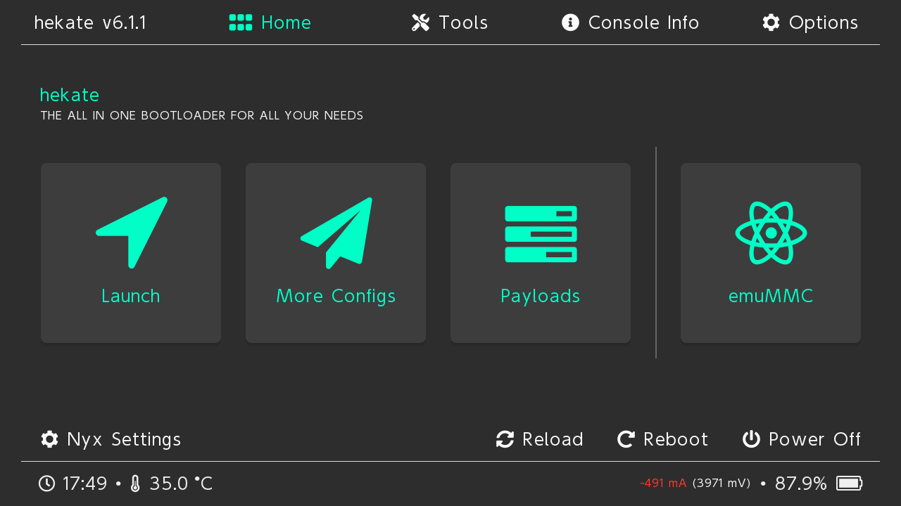

# Sending a Payload

::: warning

**If you are here to test if your Switch is patched**

Make sure you have [put your device into RCM](entering_rcm) and downloaded hekate. Once finished, if your console is **not** patched, continue with the "Preparing hekate" section at the bottom of the page.

:::

Now that the device is in RCM, we will need to send it a payload. The methods are mostly the same but slightly differ depending on what hardware you have available.

## Injecting a payload

::::: tabs

:::: tab default Windows

### Section I - Requirements

* The latest release of [OmniRCM](https://github.com/DefenderOfHyrule/OmniRCM/releases/latest) (`OmniRCM-win-x64.exe`)
* A USB-A to USB-C cable (or a standard USB-C cable if your computer natively supports USB-C)

### Section II - Instructions

1. Download and open OmniRCM.
    * If you get a SmartScreen popup, click `More info` and click `Run anyway`.
1. Connect your Switch while it's in RCM to your PC using the USB cable.
1. Click the red `Install Driver` button near the top of the window.
    * If you face issues when installing the driver, follow the driver installation with [Zadig](#optional---driver-installation-with-zadig) section below.
1. Under `Payloads`, click the `↓ Update` button to fetch the remote payloads.
1. Select the `hekate` payload.
1. Click the Green `► Inject Payload` button
    * If your payload was successfully injected your switch should have yellow text about missing libs and `Update bootloader folder!` these warnings will be resolved soon.
    * If you do not have a microSD in the system this text will instead say `Failed to init or mount SD!`. This warning can be ignored for now as well.

If you experience issues with driver installation or you just want to try a different payload injector, you can check out TegraRcmGUI and Zadig sections by unfolding them below.

::: details Alternative payload injector for Windows {closed}

### Section I - Requirements

* The latest release of [TegraRCMGUI](https://github.com/eliboa/TegraRcmGUI/releases)
* A USB-A to USB-C cable (or a standard USB-C cable if your computer natively supports USB-C)
* The latest release of [hekate](https://github.com/CTCaer/hekate/releases/). The hekate payload (`hekate_ctcaer_(version)_nyx_(version).bin`) is located inside of the `hekate_ctcaer_(version).zip`.

### Section II - Instructions

1. Install and run TegraRcmGUI.
1. Navigate to the `Settings` tab, then press `Install Driver` and follow the on-screen instructions.
1. Connect your Switch in RCM to your PC using the USB cable.
1. Navigate to the Payload tab of TegraRcmGUI
    * Your Switch should be shown as detected in the bottom left corner.
1. Press the file button next to `Inject payload`, and navigate to and select the `hekate_ctcaer_X.X.X.bin` file.
    * Do not use the hekate payload included in TegraRcmGUI. It is outdated and missing a feature needed later in the guide.
1. Click `Inject payload` to launch the payload you selected.
    * If your payload was successfully injected your switch should have yellow text about missing libs and `Update bootloader folder!` these warnings will be resolved soon.
    * If you do not have a microSD in the system this text will instead say `Failed to init or mount SD!`. This warning can be ignored for now as well.
    
:::

::: details Optional - Driver installation with Zadig (click to unfold) {closed}

### Optional - Driver installation with Zadig

Follow these steps if you face issues when installing the driver with OmniRCM. You will need the latest version of [Zadig](https://zadig.akeo.ie).

1. Launch Zadig. In the `Options` menu, be sure that `List All Devices` is enabled.
1. Connect your Switch in RCM to your PC using the USB cable.
1. In Zadig, select "APX" in the device list.
1. Select `libusbK (v3.1.0.0)` in the driver list.
1. Click `Install Driver` and wait for the installation to finish.

:::

::::

:::: tab Linux

### Section I - Requirements

* The latest release of [OmniRCM](https://github.com/DefenderOfHyrule/OmniRCM/releases/latest) (`OmniRCM-Linux-(architecture)`, based on your device's architecture)
* A USB-A to USB-C cable (or a standard USB-C cable if your computer natively supports USB-C)

### Section II - Instructions

1. Download and open OmniRCM.
    ::: details If you cannot open the executable... {closed}
    You'll need to make the executable executable if your file manager doesn't allow you to run the executable from your file manager directly. To do this, follow the instructions below:
    1. Open a terminal window,
    1. Enter the following command: `chmod +x /path/to/OmniRCM-linux-(architecture)` (replacing /path/to with the actual path to the executable).
    1. You should now be able to double click the app to open it from your file manager.
    - **Note:** most file managers *do* allow you to make a file executable by right clicking the file and going to Properties > Permissions (or similar) > Allow executing file as program. The process is roughly the same for all Linux distributions.
    :::
1. Connect your Switch while it's in RCM to your PC using the USB cable.
1. Click the red `Setup udev` button near the top of the OmniRCM window.
1. Fill in your root password in the dialogue box that appears.
1. Click `Install`
1. Log out and back in.
    * On some distributions (notably, Fedora) require a full reboot for group membership to take effect. If you still cannot inject without root permissions, try rebooting.
1. Re-open OmniRCM
1. Under `Payloads`, click the `↓ Update` button to fetch the remote payloads.
1. Select the `hekate` payload.
1. Click the Green `► Inject Payload` button
    * If your payload was successfully injected your switch should have yellow text about missing libs and `Update bootloader folder!` these warnings will be resolved soon.
    * If you do not have a microSD in the system this text will instead say `Failed to init or mount SD!`. This warning can be ignored for now as well.

---

If you experience issues with OmniRCM or you just want to try a different payload injector, you can check out the web injector by unfolding the section below.

::: details Alternative payload injector for Linux {closed}

### Section I - Requirements

* A USB-A to USB-C cable (or a standard USB-C cable if your computer natively supports USB-C)
* A Chromium based browser (ex. Chrome, Brave, etc..)

### Section II - Instructions

1. Set up the [udev rule](https://switch.hacks.guide/extras/adding_udev.html) for rootless injections
    * This is necessary unless you wish to run your browser as root every time you want to inject. 
1. Head over to https://omnircm.nintendohomebrew.com/web/
1. Connect your Switch in RCM to your PC using the USB cable.
1. Click on `Connect device...` and select `APX`.
1. Click the hekate entry in the payload list.
1. Click the Blue `Inject` button.
    * If your payload was successfully injected your switch should have yellow text about missing libs and `Update bootloader folder!` these warnings will be resolved soon.
    * If you do not have a microSD in the system this text will instead say `Failed to init or mount SD!`. This warning can be ignored for now as well.
    
::::

:::: tab macOS

### Section I - Requirements

* The latest release of [OmniRCM](https://github.com/DefenderOfHyrule/OmniRCM/releases/latest) (`OmniRCM-osx.zip`)
* A USB-A to USB-C cable (or a standard USB-C cable if your computer natively supports USB-C)

### Section II - Instructions

1. Download the latest release of OmniRCM.
1. Extract the `OmniRCM-osx.zip` archive somewhere (if needed, usually automatic).
1. Use Finder to open `OmniRCM.app`.
1. Connect your Switch while it's in RCM to your PC using the USB cable.
1. Under `Payloads`, click the `↓ Update` button to fetch the remote payloads.
1. Select the `hekate` payload.
1. Click the Green `► Inject Payload` button
    * If your payload was successfully injected your switch should have yellow text about missing libs and `Update bootloader folder!` these warnings will be resolved soon.
    * If you do not have a microSD in the system this text will instead say `Failed to init or mount SD!`. This warning can be ignored for now as well.
    
---

If you experience issues with OmniRCM or you just want to try a different payload injector, you can check out the web injector by unfolding the section below.

::: details Alternative payload injector for macOS {closed}

### Section I - Requirements

* A USB-A to USB-C cable (or a standard USB-C cable if your computer natively supports USB-C)
* A Chromium based browser (ex. Chrome, Brave, etc..)

### Section II - Instructions

1. Head over to https://omnircm.nintendohomebrew.com/web/
1. Connect your Switch in RCM to your PC using the USB cable.
1. Click on `Connect device...` and select `APX`.
1. Click the hekate entry in the payload list.
1. Click the Blue `Inject` button.
    * If your payload was successfully injected your switch should have yellow text about missing libs and `Update bootloader folder!` these warnings will be resolved soon.
    * If you do not have a microSD in the system this text will instead say `Failed to init or mount SD!`. This warning can be ignored for now as well.
    
:::

::::

:::: tab Android

### Section I - Requirements

* The latest release of [OmniRCM](https://github.com/DefenderOfHyrule/OmniRCM/releases/latest) (`OmniRCM-android.apk`)
* A USB-C cable
* If your device has a USB-C port, you may use a C-C cable
* If your device only has a Micro USB port, you will need a USB OTG adapter and a USB A-C cable

### Section II - Instructions

1. Install the `OmniRCM-android.apk` file.
1. Open the app from your Home menu.
1. Connect your Switch while it's in RCM to your Android device using the USB cable.
1. Allow OmniRCM to access the APX device. (either temporarily or permanently)
1. Tap on the `Fetch Payloads` button to fetch the remote payloads.
1. Select the `hekate` payload.
1. Tap on the `Inject` button.
    * If your payload was successfully injected your switch should have yellow text about missing libs and `Update bootloader folder!` these warnings will be resolved soon.
    * If you do not have a microSD in the system this text will instead say `Failed to init or mount SD!`. This warning can be ignored for now as well.
    
---

If you experience issues with OmniRCM or you just want to try a different payload injector, you can check out the web injector by unfolding the section below.

::: details Alternative payload injector for Android {closed}

### Section I - Requirements

* A USB-A to USB-C cable (or a standard USB-C cable if your computer natively supports USB-C)
* A Chromium based browser (ex. Chrome, Brave, etc..)

### Section II - Instructions

1. Head over to https://omnircm.nintendohomebrew.com/web/
1. Connect your Switch in RCM to your Android device using the USB cable.
1. Click on `Connect device...` and select `APX`.
1. Click the hekate entry in the payload list.
1. Click the Blue `Inject` button.
    * If your payload was successfully injected your switch should have yellow text about missing libs and `Update bootloader folder!` these warnings will be resolved soon.
    * If you do not have a microSD in the system this text will instead say `Failed to init or mount SD!`. This warning can be ignored for now as well.
    
:::

::::

:::: tab iOS (jailbroken)

### Section I - Requirements

* A jailbroken iPhone
* A lightning to USB A OTG adapter
    * Not required if you use a USB-C iPhone.
* A good quality USB A to C cable
    * If your phone has a USB-C port, you may use a C-C cable.

### Section II - Instructions

1. Visit the [OmniRCM Sileo Repository](https://omnircm.nintendohomebrew.com/repo/).
1. Press the `Add` button corresponding to your Package Manager.
1. Add the repository and sync your sources.
1. Navigate to `OmniRCM` > `Utilities` > `OmniRCM` and tap `GET`.
1. Install the app from the queue. In `Sileo`, this is in the bottom right of your screen.
1. Open the app.
1. Connect your Switch while it's in RCM to your Phone using the USB cable.s
1. Tap on the `Fetch Payloads` button to fetch the remote payloads.
1. Select the `hekate` payload.
1. Tap on the `Inject` button.
    * If your payload was successfully injected your switch should have yellow text about missing libs and `Update bootloader folder!` these warnings will be resolved soon.
    * If you do not have a microSD in the system this text will instead say `Failed to init or mount SD!`. This warning can be ignored for now as well.
    
::::

:::: tab ChromeOS

### Section I - Requirements

* A USB-A to USB-C cable

::: warning

**About USB-C**

If your Chromebook has a USB-C port, do note that this will not work using a C-C cable.

:::

### Section II - Instructions

1. Head over to https://omnircm.nintendohomebrew.com/web/
1. Connect your Switch in RCM to your PC using the USB cable.
1. Click on `Connect device...` and select `APX`.
1. Click the hekate entry in the payload list.
1. Click the Blue `Inject` button.
    * If your payload was successfully injected your switch should have yellow text about missing libs and `Update bootloader folder!` these warnings will be resolved soon.
    * If you do not have a microSD in the system this text will instead say `Failed to init or mount SD!`. This warning can be ignored for now as well.
    
::::

:::::

::: danger

**If nothing happens after you send the payload**

If your console's screen remains black after you've sent hekate (or any other payload), it's possible your payload was corrupted, or that your console is patched. If your payload injector shows that your console is patched, then it is patched. This isn't a one-time glitch or up for debate; it is patched. All results are basically fully confident. Consider an alternate method that isn't via RCM.

:::

## Preparing hekate

We will prepare the microSD card for formatting/partitioning before going to the next page. Removing the microSD card while in hekate is safe so turning off the console is not necessary and keeping it on will save time that would be spent re-injecting the payload.

::: danger

Following the guide will delete everything on your microSD card!

Later in the guide, you will be formatting and/or partitioning your microSD card. This means that all data on the microSD card will be lost. Now is a good time to back up *all* of its data to a safe place (for example, on your PC or external drive) so that you can restore it later. You can do this by following the instructions below.

:::

### Section I - Requirements

* The latest release of [hekate](https://github.com/CTCaer/hekate/releases/) (`hekate_ctcaer_(version)_nyx_(version).zip`).
* Your microSD card

### Section II - Instructions

1. Without turning your Switch off, remove the microSD card from the Switch.
1. Insert your microSD card into your computer.
1. Copy the `Nintendo` folder (and any other important data) from the root of your microSD card to a safe space on your device.
1. Extract the hekate `.zip` to a location on your computer
1. Inside the extracted hekate folder you will find a folder named `bootloader`.
1. Copy the `bootloader` folder to the root of your microSD card.
1. Put your microSD card back into your Switch.
1. Press either volume button or power to continue to the hekate menu.
    * It will say `Warning: Nyx is missing!` near the bottom of the screen, this will be resolved with the next step.
1. Use volume up and volume down to navigate the hekate menu. Hover over 'load nyx' and press the power button to select. Your screen should now have the hekate GUI (Nyx) pictured below.

    { width="600" }

::::: cards

:::: card

Click the button below to continue to choosing your CFW environment.

<a href="../all/cfw_environment" class="btn btn-solid">Continue to choosing your CFW environment →</a>

::::

:::::
