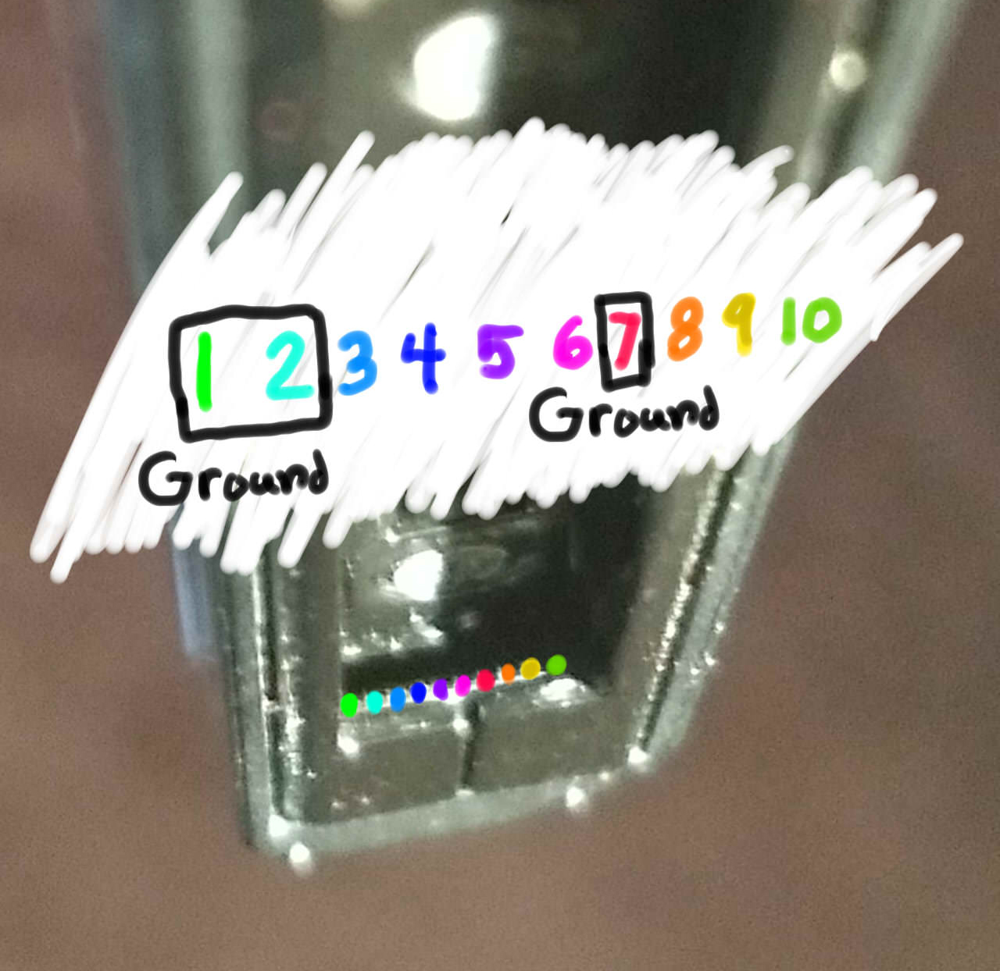
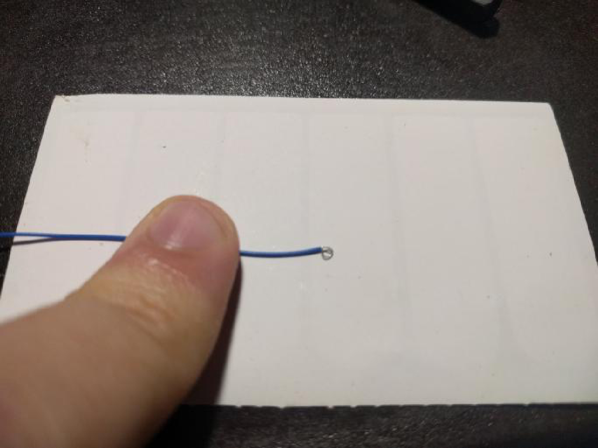
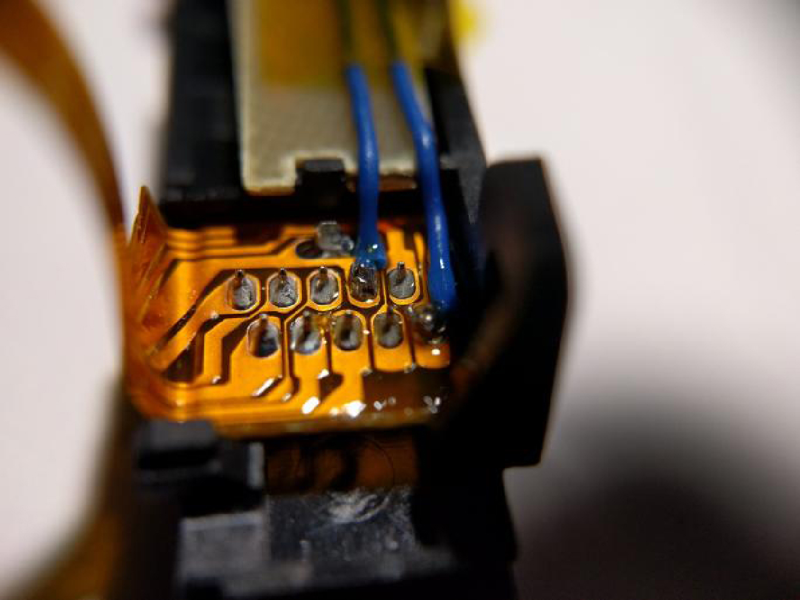
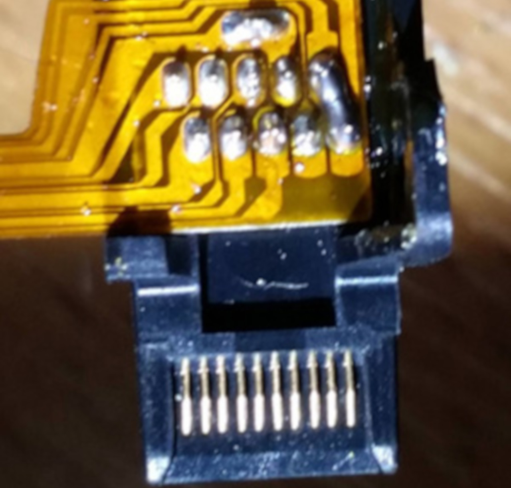
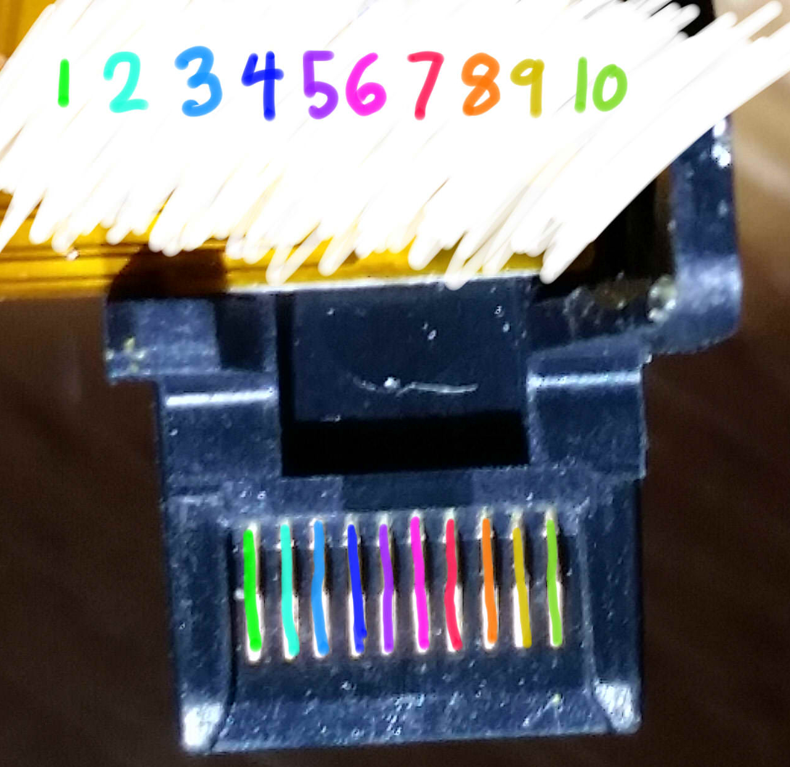

# Entering RCM

As the Switch uses a Tegra X1 processor, it has a special recovery mode that is, in most scenarios, useless for the end-user. Fortunately, due to the fusee-gelee vulnerability, this special mode acts as our gateway into CFW.

There are several methods of entering RCM (**R**e**C**overy **M**ode). The most affordable of these require nothing more than common household items, while the most reliable are very cheap ($10).

&nbsp;

!!! danger "Patched Switch"
    Note that patched units **can** enter RCM, but it is not possible to send a payload on those systems. Also note that RCM is a different recovery mode than the one accessed by holding Volume Up, Volume Down, and Power.

!!! snippet "Note"
    The order of methods on this page is in the order of ease. The easiest to immediately accomplish are listed at the top, and the most advanced/difficult methods are at the bottom.

&nbsp;

### Instructions

!!! tip ""
    1. Power off the Switch and use one of the methods listed below to short the pins on the right joycon rail.
    2. Hold Volume Up and press the Power button.

    If your Switch displays the Nintendo logo and boots normally or immediately shuts down, you didn't successfully enter RCM and should try again. Otherwise, if your console did not turn on normally, and the screen remained black with no backlight, your Switch is in RCM.

!!! tip ""
    ### RCM Jig (Easiest for beginners)
    

        
Click to expand!

    !!! snippet "Note"
        Some jig designs use paperclips, inheriting the same risks as the Metal Bridge / Paperclip method. If you would like a safe jig design, we highly recommend [switchjigs.com](https://switchjigs.com).

    This method is similar to the Metal Bridge / Paperclip method, but is more reliable and safer in many cases. Jigs hold a wire in place so the correct pins (10 and a ground) are shorted every time.

    Jigs range in price, with the ones we recommend being $5. They're slightly more expensive than some mass produced jigs, however we can guarantee their quality. Also spending $5 on a quality jig using 32-gauge wire is a smaller cost than replacing your entire Joy-Con rail after the pins are scratched off by a paperclip jig.

    !!! tip ""
        
		
	In the case you plan to make you own jig, this image lays out the pads numbers on the console. Make sure your jig NEVER touches pin 4. Pin 4 provides 5v power to the Joycons, if connected to any other pin you will fry the console.

	!!! tip ""
		

!!! tip ""
    ### Soldered Joy-Con Pads - Physical RCM Button (Safest)
    

        
Click to expand!

    !!! snippet "Note"
        This method requires opening your right Joy-Con, voiding its warranty. Not for the faint of heart.

    This method comes to us from the mind of pbanj#9188 on Discord. All pictures of this method in action were provided by him, with some supplementary images provided by eip ∞#3283 on Discord.
	
	The goal of this method is to open the right handed Joy-Con to the point that you can reach the contact pads easily. This is similar to the previous method, however you will be soldering wires to pins 7 and 10 (shown below) and wiring them to the "Joycon release button" at the top back of the right hand Joycon.

	!!! tip ""
        

    In order to start this method you will want to take two lengths of wire, and wrap one end of each into a small circle.

    !!! tip ""
        
		
	You will then want to take the circular end of one of the wires and add a small amount of solder, keeping it mostly flat (ONLY DO THIS TO ONE OF THE WIRES!). You will then glue this wire down to the below point on the Joycon release button. Make sure glue doesn't cover the top of the solder/wire as it will act as a contact point. Also, ensure that you leave enough space for the button to function correctly. Try pushing the button from the outside and observing its travel path so that you can see where and how you should safely glue the solder glob.
	
	!!! tip ""
        
		
	!!! tip ""
        
		
	The first wire should now be in place as seen by the green circle below. The second wire does not need any solder, instead you will hold it in place using the screw as shown by the red circle in the picture below.

	!!! tip ""
        

	Pressing the Joycon button in you should now notice the solder point you created making contact with the piece of metal held in by the screw. Once you have these elements in place you want to connect one wire to pad 7 and the other to pad 10 (it doesn't matter which is which). After that you have successfully created an RCM button on your Joycon. You will now need to hold down the Joycon release button when attempting to boot RCM.

	!!! tip ""
        

!!! tip ""
    ### Soldered Joy-Con Pads - 7 & 10
    

        
Click to expand!

    !!! snippet "Note"
        This method requires opening your right Joy-Con, voiding its warranty. Not for the faint of heart.

    The goal of this method is to open the right handed Joy-Con to the point that you can reach the contact pads easily. This is similar to the previous method, however the goal is to solder pins 7 and 10 (shown below) together with a surface-mount 0805 10k resistor. Apart from using a physical switch/button, this is currently considered the safest method that involves soldering to pads.

	!!! tip ""
        

    Here is an example from stuckpixel#3421 on the ReSwitched Discord server.

    !!! tip ""
        

!!! tip ""
    ### Soldered Joy-Con Pads - 9 & 10
    

        
Click to expand!

    !!! snippet "Note"
        This method will result in the right Joy-Con being detected as in wireless mode while attached to the Switch, and this method may result in the Joy-Con being permanently detected as wireless if you update the Joy-Con firmware while this mod is installed. In the latter case, fixing this requires opening up the Joy-Con and reseating the battery. It is recommended to solder pads 7 and 10 together with a resistor instead.

    !!! snippet "Note"
        This method requires opening your right Joy-Con, voiding its warranty. Not for the faint of heart.

    The goal of this method is to open the right handed Joy-Con to the point that you can reach the contact pads easily. This is similar to the previous method, however the goal is to solder pads 9 and 10 (seen below) together. This can either be done using a small wire, or directly bridging the pads with solder.

	!!! tip ""
        
	
    Here is an example from YyAoMmIi#3705 on our Discord server.

    !!! tip ""
        

!!! tip ""
    ### Bent Joy-Con Pins (Not recommended)
    

        
Click to expand!

    !!! snippet "Note"
        This method will result in the right Joy-Con being detected as in wireless mode while attached to the Switch, and this method may result in the Joy-Con being permanently detected as wireless if you update the Joy-Con firmware while this mod is installed. In the latter case, fixing this requires opening up the Joy-Con and reseating the battery.

    !!! snippet "Note"
        This method requires opening your right Joy-Con, voiding its warranty. Not for the faint of heart.

    The goal of this method is to open the right handed Joy-Con to the point that you can reach the contact pads easily, and use a thin object such as a knife to gently bend pin 9 and 10 (shown below) slightly up and towards each other so they touch, shorting them.

    !!! tip ""
        

    Here is an example from Sonlen#1414 on our Discord server.

    !!! tip ""
        

&nbsp;

#### [Continue to Sending a Payload <i class="fa fa-arrow-circle-right fa-lg"></i>](sending_payload.md)
