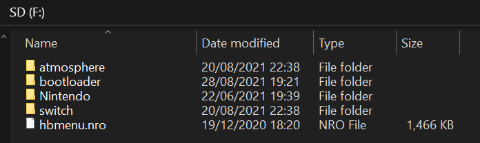

# SD Preparation

We will now place the required files for the Atmosphere custom firmware and some additional homebrew files on the SD card.

Atmosphere has its own bootloader, called fusee (primary). For the purposes of this guide we will be using Hekate instead, so that we can back up the system's NAND (internal storage) and take advantage of other advanced features in the future.

&nbsp;

!!! danger "FAT32 vs exFAT"
    Your SD card will need to be formatted as either FAT32 or exFAT, but FAT32 is recommended as it is more stable and will work out of the box with the Switch's operating system. Using exFAT on the Switch should be avoided due to the filesystem being prone to corruption, and sometimes preventing custom firmware from booting. You will also need to install the exFAT update for your Switch, which is downloaded when you insert an exFAT formatted SD card in to your Switch. Note that this will update your console and requires an internet connection.

!!! warning "File name extensions"
    If you use Windows, you should enable file name extensions before continuing. See [this link](../../extras/showing_file_extensions.md) for a guide on how to do this.

&nbsp;

### What you need

<!-- Notice for easy removal later once WITHOUT_MESOSPHERE releases aren't needed:  This section below has a notice about WITHOUT_MESOSPHERE release. -->

!!! tip ""
    - The latest release of <a href="https://github.com/CTCaer/Hekate/releases/" target="_blank">Hekate</a> (Download the `hekate_ctcaer_(version).zip` release of hekate)
    - The hekate config file: <a href="../../../files/sys/hekate_ipl.ini" download>hekate_ipl.ini</a>
    - The bootlogo zip folder: <a href="../../../files/bootlogos.zip" download>bootlogos.zip</a>
    - The latest release of <a href="https://github.com/Atmosphere-NX/Atmosphere/releases" target="_blank">Atmosphere</a>. Download the `atmosphere-(version)-master-(version)+hbl-(version)+hbmenu-(version).zip` release of Atmosphere. Do not download the `atmosphere-(version)-master-(version)-WITHOUT_MESOSPHERE+hbl-(version)+hbmenu-(version).zip` release.
    - The latest release of <a href="https://github.com/shchmue/Lockpick_RCM/releases" target="_blank">Lockpick_RCM</a> (Download the `Lockpick_RCM.bin` release of Lockpick)
    - The latest release of <a href="https://github.com/SciresM/Checkpoint/releases" target="_blank">Checkpoint</a> (Download the `Checkpoint.nro` release of Checkpoint). Note: This is a fork of checkpoint as the current release of checkpoint is broken
    - The latest release of <a href="https://github.com/mtheall/ftpd/releases" target="_blank">FTPD</a> (Download the `ftpd.nro` release of FTPD)
    - The latest release of <a href="https://github.com/exelix11/SwitchThemeInjector/releases" target="_blank">NXThemeInstaller</a> (Download the `NxThemesInstaller.nro` release of NxThemeInstaller)
    - The latest release of <a href="https://github.com/joel16/NX-Shell/releases" target="_blank">NX-Shell</a> (Download the `NX-Shell.nro` release of nx-shell)
    - The latest release of the <a href="https://github.com/vgmoose/hb-appstore/releases" target="_blank">hbappstore</a> (Download the `appstore.nro` release of hbappstore)

### Instructions

!!! tip ""
    1. Insert your Switch's SD card into your PC
    2. Copy *the contents of* the Atmosphere `.zip` file to the root of your SD card
    3. Copy the `bootloader` folder from the Hekate `.zip` file to the root of your SD card
    4. Copy the `bootloader` folder from the `bootlogos.zip` file to the root of your SD card
       - If you're asked to merge the bootloader folders, do so
    5. Copy `hekate_ipl.ini` to the `bootloader` folder on your SD card
    6. Copy `Lockpick_RCM.bin` to the `/bootloader/payloads` folder on your SD card
    7. Create a folder named `appstore` inside the `switch` folder on your SD card, and put `appstore.nro` in it
    8. Copy `Checkpoint.nro`, `ftpd.nro`, `NX-Shell.nro` and `NxThemesInstaller.nro` to the `switch` folder on your SD card
    9. Reinsert your SD card back into your Switch

    !!! tip ""
        Your SD card should look similar to this. The `Nintendo` folder will not be present if your switch has not already booted with the microSD card inserted.
        

&nbsp;

#### [Continue to Entering RCM <i class="fa fa-arrow-circle-right fa-lg"></i>](entering_rcm.md)
